---

# Isoelectric Focusing Calculator

## Observation Summary
This project is a GUI application built using tkinter that calculates the theoretical isoelectric point (pI) of a given amino acid sequence. It also generates a 3D scatter plot displaying the pI values of standard amino acids using matplotlib.

## Dependencies
- 
- 
- 

## Installation
1. Clone the repository:
    ```bash
    git clone https://github.com/rubypoddar/python-projects.git
    cd python-projects
    ```

2. Install the required dependencies:
    ```bash
    pip install matplotlib
    ```

## Usage
1. Run the application:
    ```bash
    python "3d isoelectric focusing.py"
    ```

2. Enter an amino acid sequence in the input field and click "Calculate pI" to see the theoretical pI value.

3. A 3D scatter plot of amino acids and their pI values will be displayed.

## Project Overview
### calculate_pI
This function takes an amino acid sequence as input and calculates the theoretical pI value by averaging the pI values of the amino acids in the sequence.

### on_calculate
This function is triggered when the "Calculate pI" button is clicked. It validates the input sequence, calculates the pI, updates the result label, and generates a 3D scatter plot of amino acids and their pI values.

### tkinter GUI
A simple tkinter GUI is created with an entry field for the amino acid sequence, a button to calculate the pI, and a label to display the result.

## Flowchart
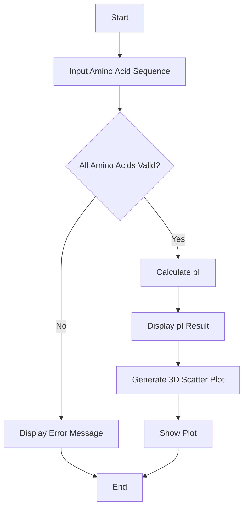
```mermaid
flowchart TD
    A[Start] --> B[Input Amino Acid Sequence]
    B --> C{All Amino Acids Valid?}
    C -->|Yes| D[Calculate pI]
    D --> E[Display pI Result]
    E --> F[Generate 3D Scatter Plot]
    F --> G[Show Plot]
    C -->|No| H[Display Error Message]
    H --> I[End]
    G --> I[End]
```

## Required


---

---

# Antibody Dilution Calculator

## Observation Summary
This project is a GUI application built using tkinter that calculates the required dilution factor and the volume of stock solution needed for an antibody dilution. It also generates a bar plot displaying the results using matplotlib.

## Dependencies
- 
- 
- 
- 

## Installation
1. Clone the repository:
    ```bash
    git clone https://github.com/rubypoddar/python-projects.git
    cd python-projects
    ```

2. Install the required dependencies:
    ```bash
    pip install matplotlib pandas
    ```

## Usage
1. Run the application:
    ```bash
    python "Antibody Dilution.py"
    ```

2. Enter the stock concentration, final concentration, and final volume in the input fields.

3. Click "Calculate Dilution" to see the dilution factor and the volume of stock solution needed.

4. A bar plot of the dilution results will be displayed.

## Project Overview
### calculate_antibody_dilution
This function takes input from the user for stock concentration, final concentration, and final volume, then calculates the required dilution factor and the volume of stock solution needed. It also generates a bar plot displaying these results using matplotlib.

### tkinter GUI
A simple tkinter GUI is created with entry fields for stock concentration, final concentration, and final volume, a button to calculate the dilution, and a label to display the result.

## Flowchart
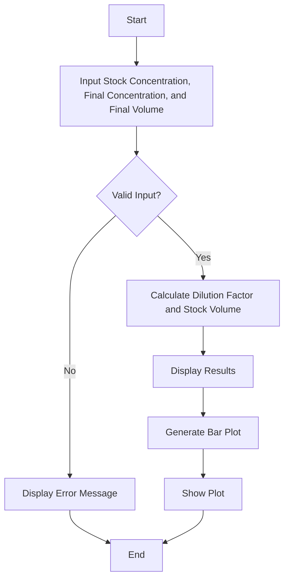
```mermaid
flowchart TD
    A[Start] --> B[Input Stock Concentration, Final Concentration, and Final Volume]
    B --> C{Valid Input?}
    C -->|Yes| D[Calculate Dilution Factor and Stock Volume]
    D --> E[Display Results]
    E --> F[Generate Bar Plot]
    F --> G[Show Plot]
    C -->|No| H[Display Error Message]
    H --> I[End]
    G --> I[End]
```

## Required


---

# BCA Protein Assay Calculator

## Overview
This Python script calculates the concentration of a protein solution using the BCA (Bicinchoninic Acid) assay method. It generates a standard curve from known protein standard concentrations and their corresponding absorbance values, and then estimates the protein concentration of an unknown sample based on its absorbance.

## Features
- **Standard Curve Generation**: Calculates the slope and intercept of the standard curve using linear regression.
- **Protein Concentration Calculation**: Estimates the protein concentration of an unknown sample using the standard curve equation.
- **Plotting**: Generates a plot of the standard curve using matplotlib to visualize the relationship between protein concentrations and absorbance values.

## Dependencies
- Python 3.x
- numpy 1.21.0
- matplotlib 3.4.3

## Installation
1. Clone the repository:
    ```bash
    git clone https://github.com/rubypoddar/python-projects.git
    cd python-projects
    ```

2. Install dependencies:
    ```bash
    pip install numpy matplotlib
    ```

## Usage
1. Run the script:
    ```bash
    python BCA_protein_assay_calculator.py
    ```

2. Follow the prompts to enter the known protein standard concentrations and absorbance values.

3. The script will plot the standard curve and prompt you to enter the absorbance value of the unknown sample.

4. It will then calculate and display the estimated protein concentration of the unknown sample.

## Code Explanation
### `generate_standard_curve`
- Calculates the slope and intercept of the standard curve using numpy's `polyfit` function.

### `calculate_protein_concentration`
- Estimates the protein concentration of an unknown sample using the equation derived from the standard curve.

### `plot_standard_curve`
- Uses matplotlib to plot the standard curve based on provided data points.

### `main`
- Orchestrates the flow of the program, handling user input, data validation, function calls, and result display.

## Flowchart
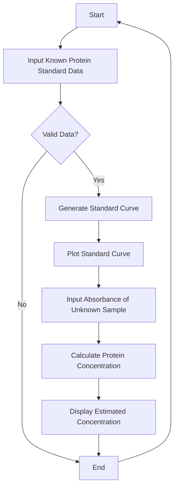
```mermaid
flowchart TD
    A[Start] --> B[Input Known Protein Standard Data]
    B --> C{Valid Data?}
    C -->|Yes| D[Generate Standard Curve]
    D --> E[Plot Standard Curve]
    E --> F[Input Absorbance of Unknown Sample]
    F --> G[Calculate Protein Concentration]
    G --> H[Display Estimated Concentration]
    C -->|No| I[Display Error Message]
    H --> I[End]
    I --> A[Start]
```

## Required


---

# Bacterial Transformation Efficiency Calculator

## Overview
This Python GUI application calculates the transformation efficiency of bacterial cells based on transformed colonies, DNA volume, and competent cells volume. It provides the transformation efficiency in CFU/µg (Colony-Forming Units per microgram).

## Features
- **Input Fields**: Enter the number of transformed colonies, DNA volume, and competent cells volume.
- **Calculation**: Computes the transformation efficiency using the formula: `Transformation Efficiency = Transformed Colonies / (DNA Volume * Competent Cells Volume)`.
- **Output**: Displays the calculated transformation efficiency in CFU/µg.

## Dependencies
- Python 3.x
- tkinter (standard library)

## Installation
1. Clone the repository:
    ```bash
    git clone https://github.com/rubypoddar/python-projects.git
    cd python-projects
    ```

2. Ensure Python 3.x is installed on your system.

## Usage
1. Run the application:
    ```bash
    python Bacterial Transformation Efficiency.py
    ```

2. Enter the number of transformed colonies, DNA volume in µg, and competent cells volume in µL.
3. Click the "Calculate" button to compute the transformation efficiency.
4. The result will be displayed below the input fields.

## Code Explanation
### `calculate_transformation_efficiency`
- Retrieves input values for transformed colonies, DNA volume, and competent cells volume.
- Calculates the transformation efficiency using the provided formula.
- Updates the result label with the calculated efficiency.

### GUI Components
- **Labels and Entries**: Used to input data for transformed colonies, DNA volume, and cells volume.
- **Calculate Button**: Triggers the transformation efficiency calculation.
- **Result Label**: Displays the calculated transformation efficiency.

## Flowchart
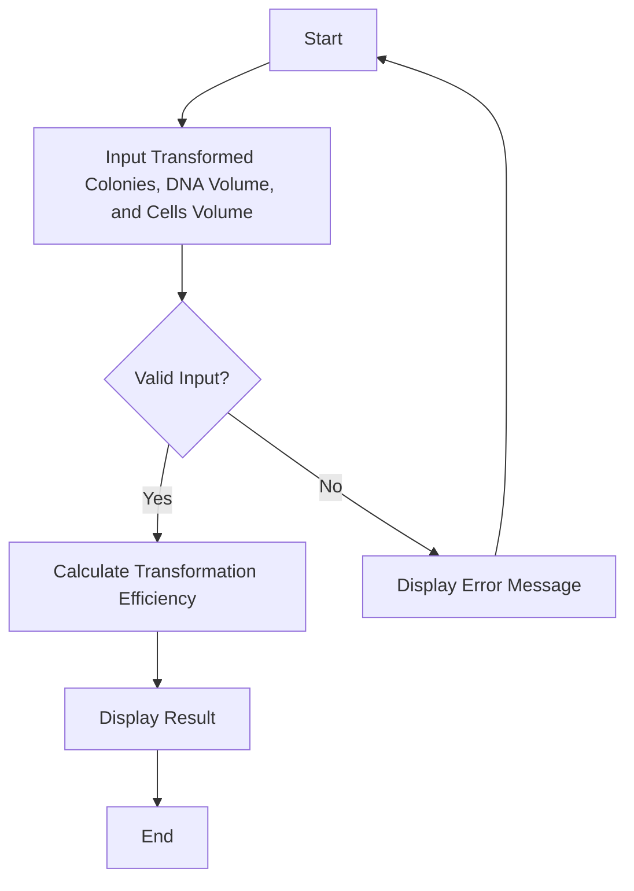
```mermaid
flowchart TD
    A[Start] --> B[Input Transformed Colonies, DNA Volume, and Cells Volume]
    B --> C{Valid Input?}
    C -->|Yes| D[Calculate Transformation Efficiency]
    D --> E[Display Result]
    E --> F[End]
    C -->|No| G[Display Error Message]
    G --> A
```

## Required
- 
- 

---

# Bradford Protein Assay Calculator

## Overview
This Python script calculates the protein concentration using the Bradford assay based on protein standard concentrations and their corresponding absorbance values. It performs linear regression to generate a standard curve and uses it to estimate protein concentrations in mg/mL.

## Features
- **Input Fields**: Enter protein standard concentrations and absorbance values.
- **Calculation**: Performs linear regression to generate a standard curve and calculates protein concentrations.
- **Output**: Displays the standard curve plot and estimated protein concentrations.

## Dependencies
- Python 3.x
- numpy
- matplotlib

## Installation
1. Clone the repository:
    ```bash
    git clone https://github.com/rubypoddar/python-projects.git
    cd python-projects
    ```

2. Install dependencies:
    ```bash
    pip install numpy matplotlib
    ```

## Usage
1. Run the script:
    ```bash
    python Bradford_Protein_Assay_Calculator.py
    ```

2. Enter protein standard concentrations and absorbance values as prompted.
3. The script will plot the standard curve and display estimated protein concentrations.

## Code Explanation
### `linear_regression`
- Performs linear regression to calculate the slope and intercept of the standard curve.

### `bradford_assay`
- Calculates protein concentrations using the linear regression results from `linear_regression`.

### `plot_standard_curve`
- Plots the standard curve using matplotlib based on provided protein standard concentrations, absorbance values, and calculated protein concentrations.

### Flowchart
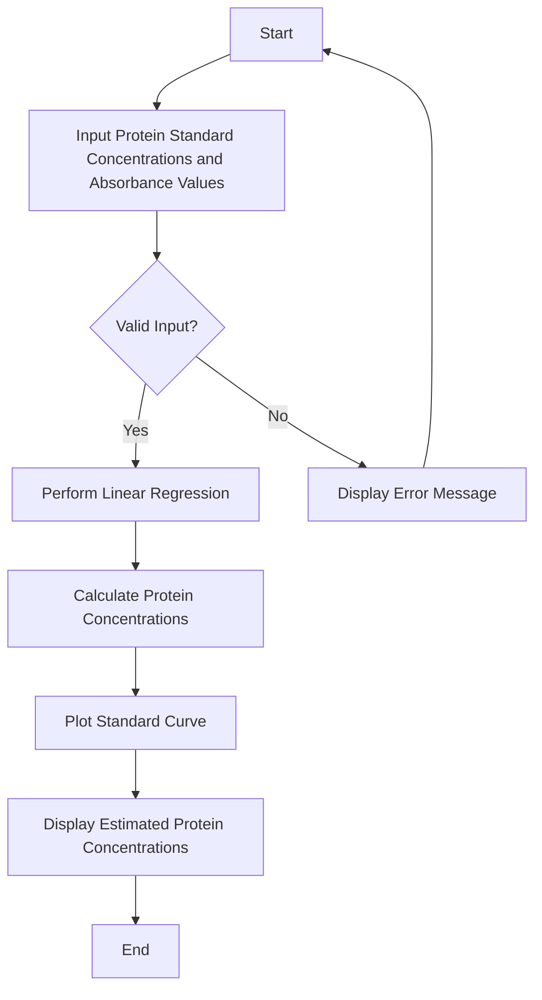
```mermaid
flowchart TD
    A[Start] --> B[Input Protein Standard Concentrations and Absorbance Values]
    B --> C{Valid Input?}
    C -->|Yes| D[Perform Linear Regression]
    D --> E[Calculate Protein Concentrations]
    E --> F[Plot Standard Curve]
    F --> G[Display Estimated Protein Concentrations]
    G --> H[End]
    C -->|No| I[Display Error Message]
    I --> A
```

## Required
- 
- 
- 


---

# Buffer Volume Calculator

## Overview
This Python script calculates the volume of stock buffer solution required to achieve a desired final concentration and volume using the formula:
\[ \text{Buffer Volume} = \frac{\text{Final Concentration} \times \text{Final Volume}}{\text{Stock Concentration}} \]

## Features
- **Input**: Allows user input for final concentration, final volume, and stock concentration.
- **Calculation**: Computes the required volume of stock buffer solution.
- **Output**: Displays the calculated volume of stock buffer solution.

## Dependencies
- Python 3.x

## Installation
1. Clone the repository:
    ```bash
    git clone https://github.com/rubypoddar/python-projects.git
    cd python-projects
    ```

## Usage
1. Run the script:
    ```bash
    python buffer_volume_calculator.py
    ```
2. Enter the desired final concentration (in mM), final volume (in mL), and stock concentration (in mM) as prompted.
3. The script will calculate and output the volume of stock buffer solution needed.

## Code Explanation
### `calculate_buffer_volume`
- Function that computes the buffer volume required based on the provided final concentration, final volume, and stock concentration.

### Error Handling
- Handles `ValueError` for invalid input (non-numeric values).
- Handles `ZeroDivisionError` specifically for when the stock concentration is zero.
- Catches unexpected errors using a generic exception handler.

### Flowchart
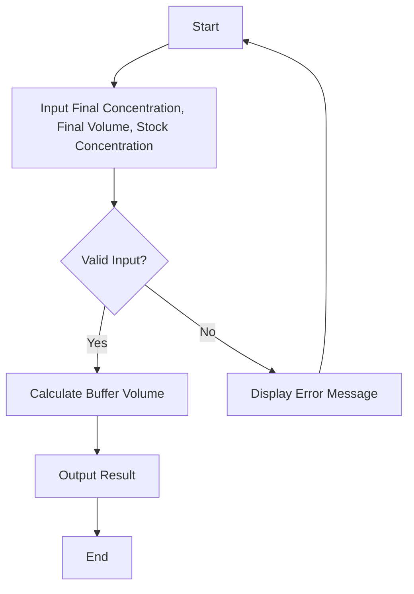
```mermaid
flowchart TD
    A[Start] --> B[Input Final Concentration, Final Volume, Stock Concentration]
    B --> C{Valid Input?}
    C -->|Yes| D[Calculate Buffer Volume]
    D --> E[Output Result]
    E --> F[End]
    C -->|No| G[Display Error Message]
    G --> A
```

## GitHub Badges
- 


---

# Cell Passaging Calculator

## Overview
This Python script calculates the number of cells to seed and the volume of medium needed for passaging based on given parameters. It is useful for maintaining consistent cell densities in cell culture experiments.

## Dependencies
- 
- 

## Installation
1. Ensure Python 3.x is installed on your system.

## Usage
1. Clone the repository:
    ```bash
    git clone https://github.com/your-username/cell-passaging-calculator.git
    cd cell-passaging-calculator
    ```

2. Run the script:
    ```bash
    python passaging_calculator.py
    ```

3. Enter the current cell density, split ratio, and target cell density as prompted.

4. The script will calculate and display the number of cells to seed and the volume of medium needed for passaging.

## Function Explanation
### `calculate_passaging`
- Calculates the number of cells to seed and the volume of medium needed based on the current cell density, split ratio, and target cell density.

### `main`
- Orchestrates the flow of the program, handling user input, function calls, and result display.

## Flowchart
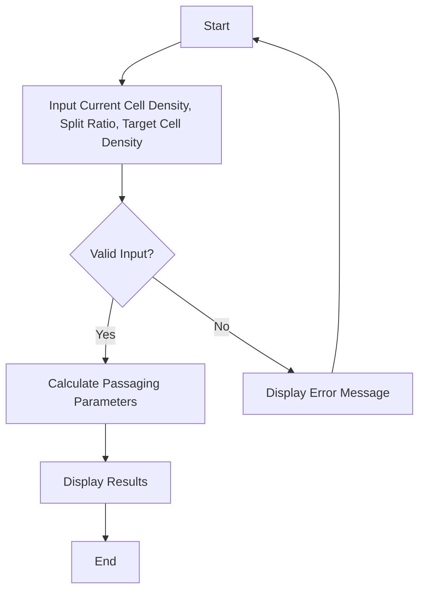
```mermaid
flowchart TD
    A[Start] --> B[Input Current Cell Density, Split Ratio, Target Cell Density]
    B --> C{Valid Input?}
    C -->|Yes| D[Calculate Passaging Parameters]
    D --> E[Display Results]
    E --> F[End]
    C -->|No| G[Display Error Message]
    G --> A
```

## Example
```bash
Enter the current cell density (cells/cm^2): 1000
Enter the split ratio (e.g., 1:2 for 1 part of cells to 2 parts of fresh medium): 1.5
Enter the target cell density after passaging (cells/cm^2): 2000
Number of cells to seed: 1500.00 cells
Volume of medium needed: 1.50 mL
```

---

# Cell Doubling Time Calculator

## Overview
This Python script calculates the doubling time of cells during a growth period based on initial and final cell counts and the duration of the growth period.

## Dependencies
- 
- 
- 
- 

## Installation
1. Ensure Python 3.x is installed on your system.
2. Install the required dependencies:
    ```bash
    pip install numpy pandas matplotlib
    ```

## Usage
1. Clone the repository:
    ```bash
    git clone https://github.com/your-username/cell-doubling-time-calculator.git
    cd cell-doubling-time-calculator
    ```

2. Run the script:
    ```bash
    python cell_doubling_time_calculator.py
    ```

3. Follow the prompts to enter the initial number of cells, final number of cells, and duration of the growth period.

4. The script will calculate and display the estimated doubling time of the cell population in hours and visualize the initial and final cell counts using a bar plot.

## Function Explanation
### `calculate_doubling_time`
- Calculates the doubling time of cells based on the initial and final cell counts and the duration of the growth period.

### `main`
- Handles user input, calls the `calculate_doubling_time` function, and displays the results.

## Flowchart
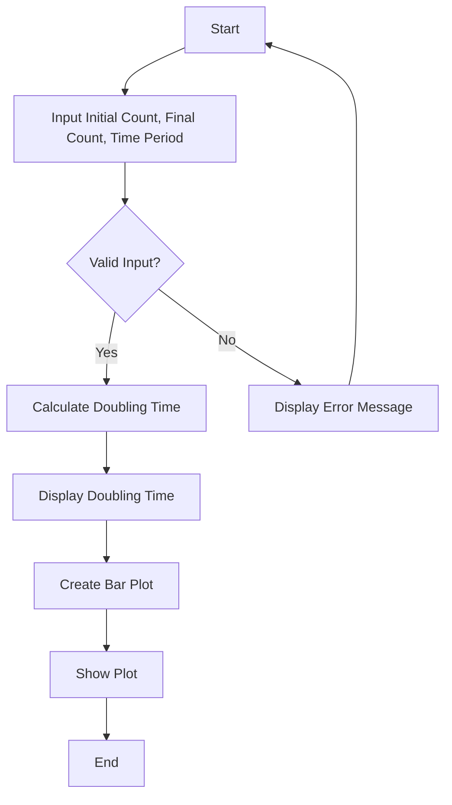
```mermaid
flowchart TD
    A[Start] --> B[Input Initial Count, Final Count, Time Period]
    B --> C{Valid Input?}
    C -->|Yes| D[Calculate Doubling Time]
    D --> E[Display Doubling Time]
    E --> F[Create Bar Plot]
    F --> G[Show Plot]
    G --> H[End]
    C -->|No| I[Display Error Message]
    I --> A
```

## Example
```bash
Welcome to the Cell Doubling Time Calculator!
This calculator estimates the time taken for a population of cells to double.

Enter the initial number of cells: 100
Enter the final number of cells: 1000
Enter the duration of the growth period (in hours): 24

Estimated Doubling Time: 7.38 hours
```

---

# Colony Forming Unit (CFU) Calculator

## Overview
This Python tkinter application calculates the Colony Forming Units per milliliter (CFU/mL) based on user inputs for dilution factor, volume plated, and colonies counted. It provides a quick estimate of the concentration of viable cells in a sample.

## Dependencies
- 
- 

## Installation
1. Ensure Python 3.x is installed on your system.

## Usage
1. Run the application:
    ```bash
    python cfu_calculator.py
    ```

2. Enter the dilution factor, volume plated (in mL), and number of colonies counted.
3. Click the "Calculate CFU/mL" button to see the calculated CFU/mL.

## Code Explanation
### `calculate_cfu`
- Retrieves input values for dilution factor, volume plated, and colonies counted.
- Calculates CFU/mL using the formula: `CFU/mL = Colonies Counted / (Dilution Factor * Volume Plated)`.
- Updates the result label with the calculated CFU/mL or displays an error message for invalid inputs.

### GUI Components
- **Entries**: Input fields for dilution factor, volume plated, and colonies counted.
- **Calculate Button**: Triggers the CFU calculation.
- **Result Label**: Displays the calculated CFU/mL or error message.

## Flowchart
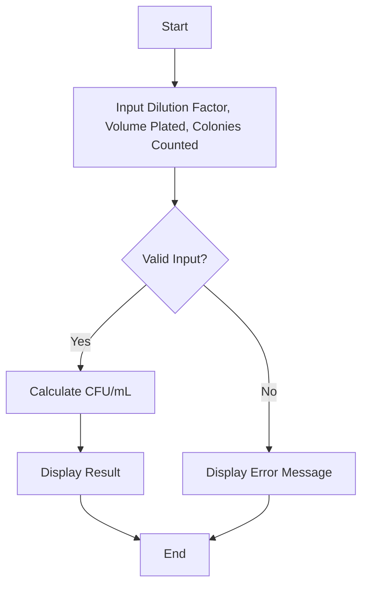
```mermaid
flowchart TD
    A[Start] --> B[Input Dilution Factor, Volume Plated, Colonies Counted]
    B --> C{Valid Input?}
    C -->|Yes| D[Calculate CFU/mL]
    D --> E[Display Result]
    E --> F[End]
    C -->|No| G[Display Error Message]
    G --> F
```

## Required
- 
- 


---

# Dynamic Light Scattering (DLS) Particle Size Calculator

## Overview
This Python tkinter application estimates the particle size using Dynamic Light Scattering (DLS) based on user inputs for temperature, viscosity, scattering angle, laser wavelength, and autocorrelation time. It provides an estimation of the particle size in nanometers (nm) using the given parameters.

## Dependencies
- 
- 
- 

## Installation
1. Ensure Python 3.x is installed on your system.
2. Install required libraries:
    ```bash
    pip install numpy
    ```

## Usage
1. Run the application:
    ```bash
    python dls_particle_size_calculator.py
    ```

2. Enter the temperature (in °C), viscosity (in cP), scattering angle (in degrees), laser wavelength (in nm), and autocorrelation time (in s).
3. Click the "Calculate" button to see the estimated particle size in nanometers.

## Code Explanation
### `dls_particle_size`
- Retrieves input values for temperature, viscosity, scattering angle, laser wavelength, and autocorrelation time.
- Calculates the particle size using the DLS formula.
- Updates the result label with the estimated particle size or displays an error message for invalid inputs.

### GUI Components
- **Entries**: Input fields for temperature, viscosity, scattering angle, laser wavelength, and autocorrelation time.
- **Calculate Button**: Triggers the particle size calculation.
- **Result Label**: Displays the estimated particle size or error message.

## Flowchart
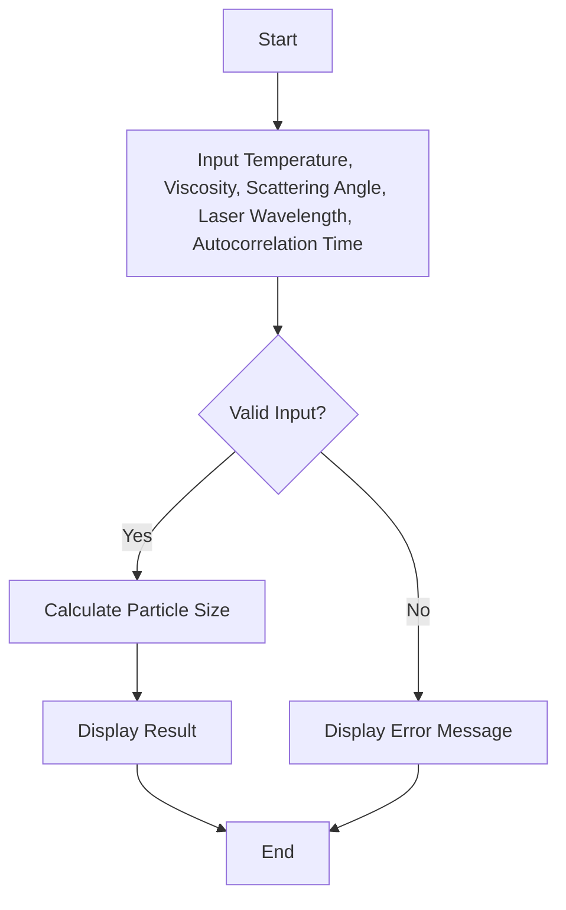
```mermaid
flowchart TD
    A[Start] --> B[Input Temperature, Viscosity, Scattering Angle, Laser Wavelength, Autocorrelation Time]
    B --> C{Valid Input?}
    C -->|Yes| D[Calculate Particle Size]
    D --> E[Display Result]
    E --> F[End]
    C -->|No| G[Display Error Message]
    G --> F
```

## Required
- 
- 
- 

---

# DNA/RNA Sequence Molecular Weight Calculator

## Overview
This Python script calculates the molecular weight of a DNA or RNA sequence based on its nucleotide composition. It considers the atomic weights of carbon (C), hydrogen (H), nitrogen (N), and oxygen (O) to compute the total molecular weight in grams per mole (g/mol).

## Dependencies
- 
- 
- 

## Installation
1. Ensure Python 3.x is installed on your system.
2. Install required libraries:
    ```bash
    pip install pandas numpy
    ```

## Usage
1. Run the script:
    ```bash
    python calculate_molecular_weight.py
    ```

2. Enter the DNA/RNA sequence when prompted.
3. Specify whether the sequence is RNA by entering 'y' or 'n' when prompted.
4. The script will calculate and display the molecular weight of the sequence in g/mol.

## Code Explanation
### `calculate_molecular_weight`
- Computes the molecular weight based on the nucleotide composition of the input sequence.
- Adjusts for RNA sequences by subtracting one oxygen atom due to uracil replacing thymine.
- Uses atomic weights of C (12.01), H (1.01), N (14.01), and O (16.00) to calculate molecular weight.

### Input Handling
- Prompts the user to input the DNA/RNA sequence and specify if it's RNA.
- Handles user input validation to ensure correct sequence type identification.

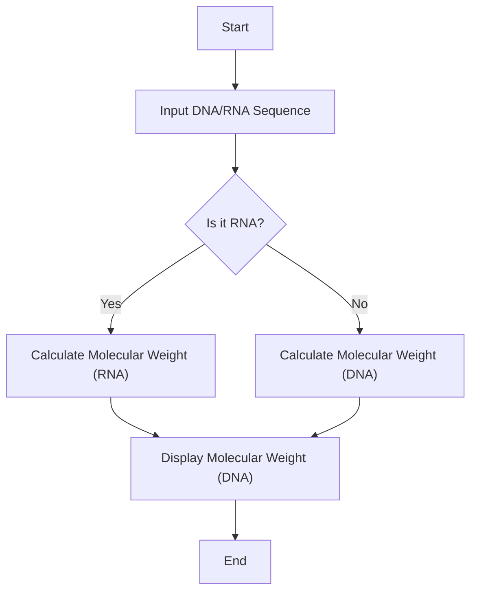
```mermaid
flowchart TD
    A[Start] --> B["Input DNA/RNA Sequence"]
    B --> C{Is it RNA?}
    C -->|Yes| D["Calculate Molecular Weight (RNA)"]
    D --> E["Display Molecular Weight (RNA)"]
    C -->|No| F["Calculate Molecular Weight (DNA)"]
    F --> E["Display Molecular Weight (DNA)"]
    E --> G[End]
```

## Required
- 
- 
- 

---

# Protein-DNA Binding Affinity Calculator

## Overview
This Python script calculates the binding affinity between a protein and DNA sequence based on the dissociation constant (Kd) and DNA concentration using a logistic function. It visualizes the calculated binding affinities using a line plot.

## Dependencies
- 
- 
- 
- 

## Installation
1. Ensure Python 3.x is installed on your system.
2. Install required libraries:
    ```bash
    pip install numpy matplotlib seaborn
    ```

## Usage
1. Run the script:
    ```bash
    python binding_affinity_calculator.py
    ```

2. Enter DNA concentrations separated by commas when prompted.
3. Enter the dissociation constant (Kd) and the cooperativity factor (optional).
4. The script will calculate and display the binding affinities and visualize them in a line plot using Seaborn.

## Code Explanation
### `binding_affinity_model`
- Calculates the binding affinity using a logistic function based on DNA concentrations, Kd, and cooperativity (optional).
- Returns an array of calculated binding affinities.

### Input Handling
- Prompts the user to input DNA concentrations and parameters (Kd, cooperativity).
- Converts user input into appropriate data types and handles input validation.

## Flowchart
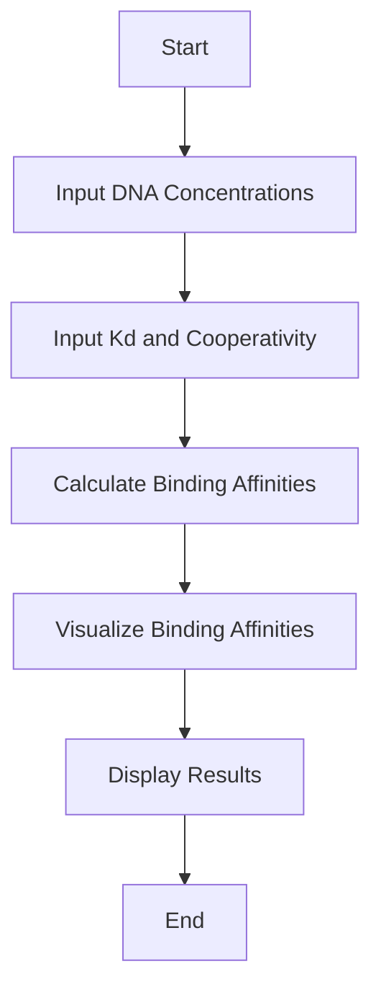
```mermaid
flowchart TD
    A[Start] --> B[Input DNA Concentrations]
    B --> C[Input Kd and Cooperativity]
    C --> D[Calculate Binding Affinities]
    D --> E[Visualize Binding Affinities]
    E --> F[Display Results]
    F --> G[End]
```

## Required
- 
- 
- 
- 

---

# Melting Temperature (Tm) Calculator

## Overview
This Python script calculates the melting temperature (Tm) of a DNA sequence using the nearest-neighbor method based on the thermodynamic parameters of adjacent nucleotide pairs. It provides an estimation of the temperature at which half of the DNA strands are in the double-helix state and half are in the single-strand state.

## Dependencies
- 
  
## Installation
1. Ensure Python 3.x is installed on your system.

## Usage
1. Run the script:
    ```bash
    python tm_calculator.py
    ```

2. Enter a DNA sequence when prompted.
3. The script will calculate and display the melting temperature (Tm) of the sequence.

## Code Explanation
### `calculate_tm`
- Calculates Tm using the nearest-neighbor method, which sums the enthalpy and entropy contributions of adjacent nucleotide pairs.
- Estimates Tm based on the formula derived from these contributions and the concentration of DNA.

### Input Handling
- Prompts the user to input a DNA sequence.
- Validates input and calculates Tm based on the provided sequence.

## Flowchart


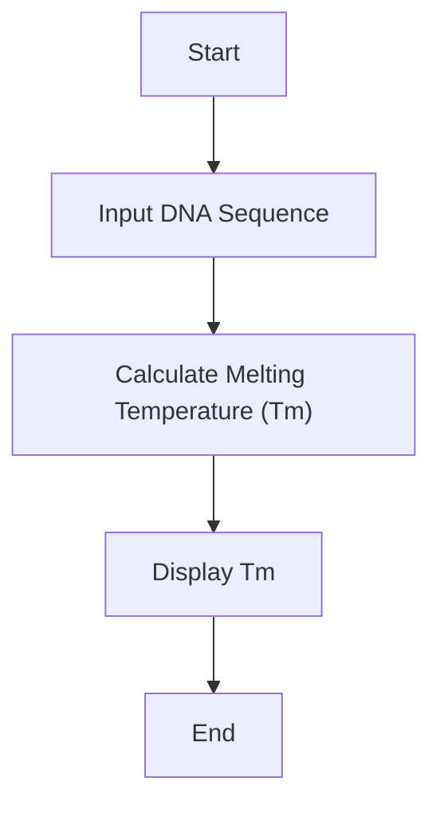
```mermaid
flowchart TD
    A[Start] --> B["Input DNA Sequence"]
    B --> C["Calculate Melting Temperature (Tm)"]
    C --> D["Display Tm"]
    D --> E[End]
```


## Required
- 

---

# Dilution Calculator

## Overview
This Python script calculates the final concentration of a solution after dilution based on the initial concentration, initial volume, and final volume of the solution. It's useful for laboratory settings where precise dilutions are required.

## Dependencies
- 

## Installation
1. Ensure Python 3.x is installed on your system.

## Usage
1. Run the script:
    ```bash
    python dilution_calculator.py
    ```

2. Enter the initial concentration, initial volume, and final volume of the solution when prompted.
3. The script will calculate and display the final concentration of the solution after dilution.

## Code Explanation
### `calculate_final_concentration`
- Calculates the final concentration of a solution after dilution using the formula:
  \[
  \text{Final Concentration} = \frac{\text{Initial Concentration} \times \text{Initial Volume}}{\text{Final Volume}}
  \]
- Returns the final concentration in units of mol/L or M (molarity).

### Input Handling
- Prompts the user to input the initial concentration, initial volume, and final volume.
- Validates input and computes the final concentration based on the provided values.

## Flowchart
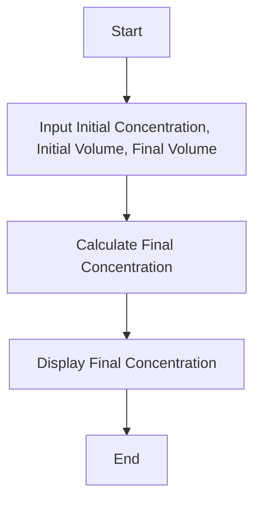
```mermaid
flowchart TD
    A[Start] --> B[Input Initial Concentration, Initial Volume, Final Volume]
    B --> C[Calculate Final Concentration]
    C --> D[Display Final Concentration]
    D --> E[End]
```

## Example
Suppose we have an initial concentration of 0.1 M, initial volume of 2 L, and final volume of 10 L:
- Input:
  - Initial concentration: 0.1
  - Initial volume: 2
  - Final volume: 10
- Output:
  - Final Concentration of the Solution: 0.02 mol/L

## Required
- 

---


# Advanced Dilution Calculator

## Overview
This Python script computes the final concentration of a solution after dilution, supporting multiple concentration units (M, mM, μM). It also visualizes the dilution process using matplotlib.

## Dependencies
- 
- 
- 
- 

## Installation
1. Ensure Python 3.x is installed on your system.
2. Install required libraries:
   ```bash
   pip install numpy pandas matplotlib
   ```

## Usage
1. Run the script:
    ```bash
    python dilution_calculator.py
    ```

2. Enter the initial concentration (in mol/L), initial volume (in liters), final volume (in liters), and unit of concentration (M, mM, or μM) when prompted.
3. The script will calculate and display the final concentration of the solution after dilution.
4. A plot illustrating the dilution process will be displayed using matplotlib.

## Code Explanation
### `calculate_final_concentration`
- Calculates the final concentration of a solution after dilution based on the provided initial concentration, initial volume, final volume, and concentration unit (M, mM, μM).
- Handles different concentration units to ensure accurate calculation and output.

### Input Handling
- Prompts the user to input the initial concentration, initial volume, final volume, and concentration unit.
- Validates input to ensure non-negative values for concentration and volumes.

### Visualization
- Uses matplotlib to visualize the dilution process with a plot showing how concentration changes with volume during dilution.

## Flowchart
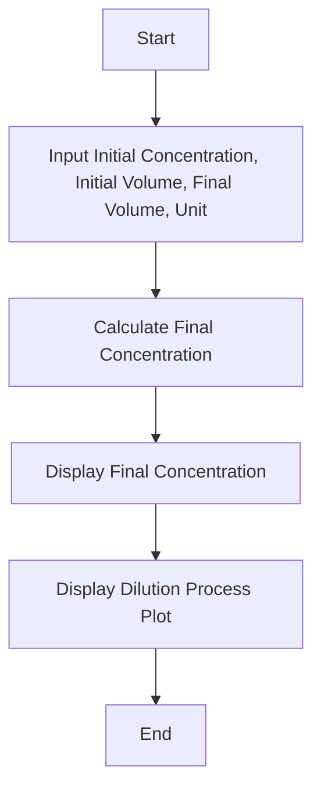
```mermaid
flowchart TD
    A[Start] --> B[Input Initial Concentration, Initial Volume, Final Volume, Unit]
    B --> C[Calculate Final Concentration]
    C --> D[Display Final Concentration]
    D --> E[Display Dilution Process Plot]
    E --> F[End]
```

## Example
Suppose we have an initial concentration of 0.1 M, initial volume of 2 L, final volume of 10 L, and unit 'M':
- Input:
  - Initial concentration: 0.1
  - Initial volume: 2
  - Final volume: 10
  - Unit: M
- Output:
  - Final Concentration of the Solution: 0.0200 M

## Required
- 
- 
- 
- 

---
# Drug Dose Calculator (for in vitro experiments)

## Overview
This tkinter-based application calculates the volume of stock solution needed based on the stock concentration, final concentration, and final volume for drug dosing in in vitro experiments.

## Dependencies
- 
- 

## Installation
1. Ensure Python 3.x is installed on your system.
2. No additional libraries are required as tkinter is included in Python's standard library.

## Usage
1. Run the script:
    ```bash
    python drug_dose_calculator.py
    ```
2. Enter the stock concentration (in mg/mL), final concentration (in mg/mL), and final volume (in mL) when prompted.
3. Click the "Calculate Drug Dose" button to compute the required volume of stock solution.
4. The application will display the volume of stock solution needed in mL.

## Code Explanation
### `calculate_drug_dose`
- Retrieves input values for stock concentration, final concentration, and final volume from tkinter Entry widgets.
- Calculates the required volume of stock solution using the formula: \( \text{Stock Volume} = \frac{\text{Final Concentration} \times \text{Final Volume}}{\text{Stock Concentration}} \).
- Handles exceptions for invalid input values.

### GUI Components
- **Labels and Entries:** tkinter widgets for inputting stock concentration, final concentration, and final volume.
- **Calculate Button:** Executes the `calculate_drug_dose` function when clicked.
- **Result Label:** Displays the calculated volume of stock solution needed.

### Flowchart
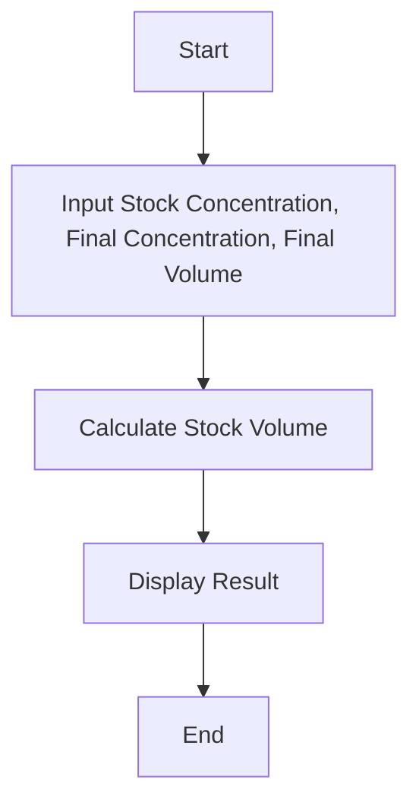
```mermaid
flowchart TD
    A[Start] --> B[Input Stock Concentration, Final Concentration, Final Volume]
    B --> C[Calculate Stock Volume]
    C --> D[Display Result]
    D --> E[End]
```

## Example
Suppose we have:
- Stock concentration: 10 mg/mL
- Final concentration: 2 mg/mL
- Final volume: 50 mL
- Output:
  - Required Volume of Stock Solution: 10 mL

## Required
- 
- 

---


# ELISA Standard Curve Calculator

## Overview
This Python script generates a standard curve for ELISA assays based on provided concentration and absorbance values. It fits a linear regression model to the data points, allowing estimation of sample concentrations from absorbance readings.

## Dependencies
- 
- 
- 

## Installation
1. Ensure Python 3.x is installed on your system.
2. Install required libraries:
    ```bash
    pip install numpy matplotlib
    ```

## Usage
1. Run the script:
    ```bash
    python elisa_standard_curve.py
    ```

2. Enter the number of standard curve points and provide concentration (ng/mL) and absorbance values for each point as prompted.
3. Input the absorbance value of the sample to estimate its concentration.
4. The script will display the standard curve plot and the estimated concentration of the sample.

## Code Explanation
### `standard_curve`
- Fits a linear regression model to the provided concentration and absorbance values.
- Returns the slope and intercept of the standard curve.

### `analyze_sample`
- Estimates the concentration of a sample based on its absorbance using the slope and intercept of the standard curve.

### Plotting
- Generates a scatter plot of the standard curve points and overlays a linear fit line.
- Displays the plot with appropriate labels and title.

## Flowchart
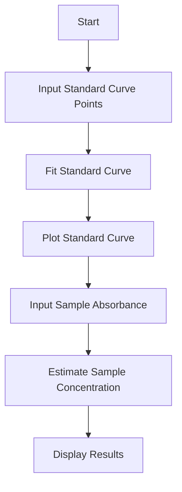
```mermaid
flowchart TD
    A[Start] --> B[Input Standard Curve Points]
    B --> C[Fit Standard Curve]
    C --> D[Plot Standard Curve]
    D --> E[Input Sample Absorbance]
    E --> F[Estimate Sample Concentration]
    F --> G[Display Results]
```

## Example
Suppose we have:
- Standard curve points:
  - Concentration: [10, 20, 30, 40, 50] ng/mL
  - Absorbance: [0.1, 0.2, 0.3, 0.4, 0.5]
- Sample absorbance: 0.35
- Output:
  - Estimated concentration of sample: 35.00 ng/mL

---


# ELISA Plate Calculator

## Overview
This Python script assists in designing ELISA experiments by calculating reagent volumes required for each well on the ELISA plate. It takes into account the sample volume, sample concentration, antibody volume, antibody concentration, and substrate volume.

## Dependencies
- 
- 
- 
- 

## Installation
1. Ensure Python 3.x is installed on your system.
2. Install required libraries:
    ```bash
    pip install numpy pandas matplotlib
    ```

## Usage
1. Run the script:
    ```bash
    python elisa_plate_calculator.py
    ```

2. Follow the prompts to enter the required parameters:
   - Volume of sample to be added to each well (in μL).
   - Concentration of sample (in ng/mL).
   - Volume of antibody to be added to each well (in μL).
   - Concentration of antibody (in μg/mL).
   - Volume of substrate to be added to each well (in μL).

3. The script will calculate and display the reagent volumes for each well in a tabular format and visualize them using a heatmap.

## Code Explanation
### `calculate_reagent_volumes`
- Computes the volumes of sample, antibody, and substrate for each well on the ELISA plate based on user inputs.
- Uses numpy arrays and pandas DataFrame to manage and present the data.

### Input Handling
- Prompts the user to input parameters necessary for the ELISA plate setup.
- Provides error handling for invalid input values.

### Plotting
- Generates a heatmap using matplotlib to visually represent the calculated reagent volumes across the plate.

## Flowchart
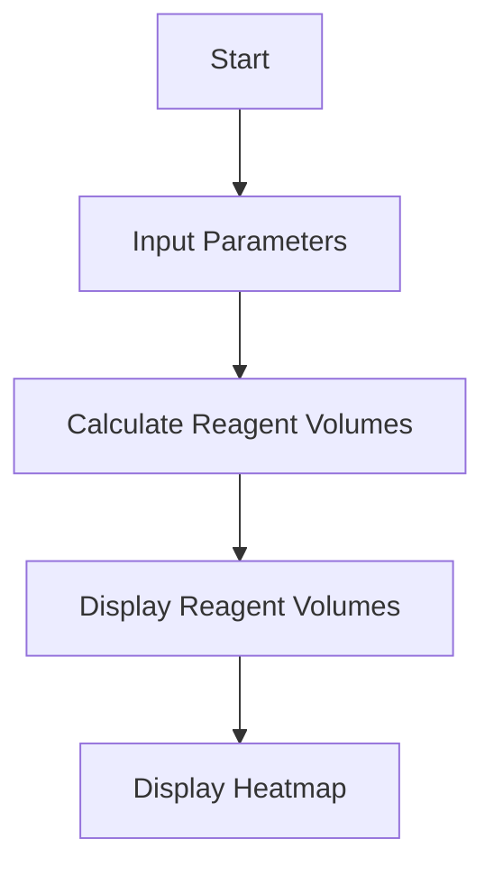
```mermaid
flowchart TD
    A[Start] --> B[Input Parameters]
    B --> C[Calculate Reagent Volumes]
    C --> D[Display Reagent Volumes]
    D --> E[Display Heatmap]
```

## Example
Suppose we input:
- Sample volume: 10 μL
- Sample concentration: 100 ng/mL
- Antibody volume: 5 μL
- Antibody concentration: 50 μg/mL
- Substrate volume: 20 μL

The script will compute and display the reagent volumes for each well and show a heatmap visualizing these volumes.

---

# Enzyme Activity Calculator

## Overview
This tkinter-based application calculates the enzyme activity based on substrate concentration, enzyme concentration, and reaction time. It provides a simple interface for researchers and scientists to quickly compute enzyme activity for experimental setups.

## Dependencies
- 
- 

## Installation
1. Ensure Python 3.x is installed on your system.
2. No additional libraries are required as tkinter is included in Python's standard library.

## Usage
1. Run the script:
    ```bash
    python enzyme_activity_calculator.py
    ```

2. Enter the substrate concentration, enzyme concentration, and reaction time in the respective fields.
3. Click the "Calculate" button to compute the enzyme activity.
4. The calculated enzyme activity will be displayed below the button.

## Code Explanation
### `calculate_enzyme_activity`
- Retrieves input values for substrate concentration, enzyme concentration, and reaction time from tkinter Entry widgets.
- Calculates the enzyme activity using the formula:
  \[ \text{Enzyme Activity} = \frac{\text{Substrate Concentration}}{\text{Reaction Time} \times \text{Enzyme Concentration}} \]
- Handles exceptions for invalid input values.

### GUI Components
- **Labels and Entries:** tkinter widgets for entering substrate concentration, enzyme concentration, and reaction time.
- **Calculate Button:** Executes the `calculate_enzyme_activity` function when clicked.
- **Result Label:** Displays the calculated enzyme activity.

### Flowchart
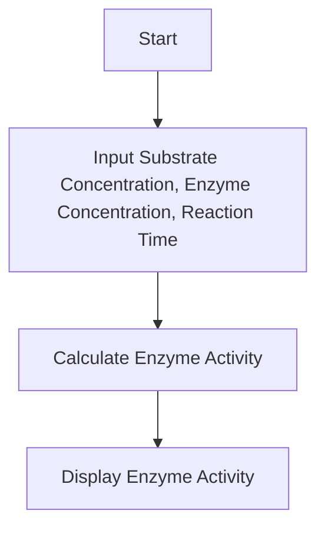
```mermaid
flowchart TD
    A[Start] --> B[Input Substrate Concentration, Enzyme Concentration, Reaction Time]
    B --> C[Calculate Enzyme Activity]
    C --> D[Display Enzyme Activity]
```

## Example
Suppose we input:
- Substrate Concentration: 100 μM
- Enzyme Concentration: 10 μg/mL
- Reaction Time: 30 minutes

The script will compute and display the enzyme activity based on these inputs.

## Required
- 
- 

---


# Enzyme Kinetics Calculator

## Overview
This tkinter-based application calculates the enzyme kinetics using the Michaelis-Menten equation based on user-provided substrate concentrations, maximum reaction rate (vmax), and Michaelis constant (km). It visualizes the enzyme kinetics curve for analysis.

## Dependencies
- 
- 
- 
- 

## Installation
1. Ensure Python 3.x is installed on your system.
2. Install required libraries:
   ```bash
   pip install numpy matplotlib
   ```

## Usage
1. Run the script:
   ```bash
   python enzyme_kinetics_calculator.py
   ```

2. Enter the substrate concentrations (comma-separated), vmax, and km in the respective fields.
3. Click the "Analyze" button to compute and visualize the enzyme kinetics curve.
4. The application will display the plot showing the relationship between substrate concentration and reaction rate.

## Code Explanation
### `michaelis_menten`
- Calculates the reaction rate using the Michaelis-Menten equation:
  \[ \text{Reaction Rate} = \frac{\text{vmax} \times \text{Substrate Concentration}}{\text{km} + \text{Substrate Concentration}} \]
- Takes arrays of substrate concentrations, vmax, and km as inputs.

### `plot_enzyme_kinetics`
- Plots the enzyme kinetics curve using matplotlib.
- Visualizes the relationship between substrate concentration and reaction rate.

### GUI Components
- **Labels and Entries:** tkinter widgets for entering substrate concentrations, vmax, and km.
- **Analyze Button:** Executes the `analyze_enzyme_kinetics` function when clicked.
- **Error Handling:** Displays an error message box for invalid inputs using tkinter's `messagebox`.

### Flowchart
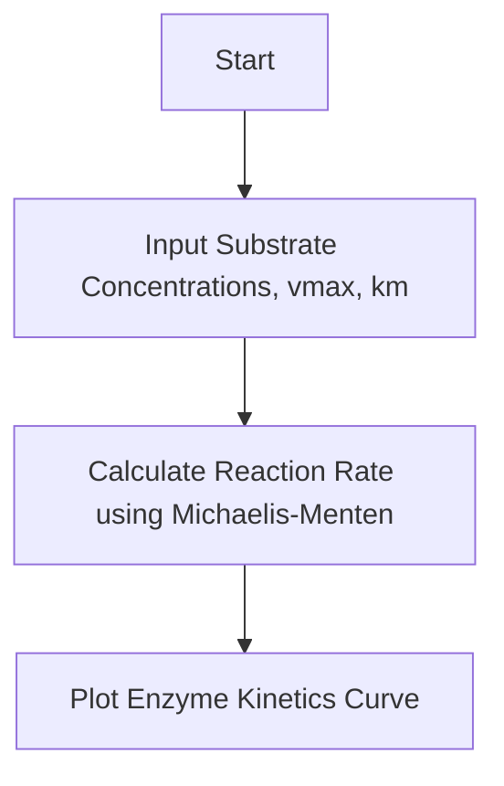
```mermaid
flowchart TD
    A[Start] --> B[Input Substrate Concentrations, vmax, km]
    B --> C[Calculate Reaction Rate using Michaelis-Menten]
    C --> D[Plot Enzyme Kinetics Curve]
```

## Example
Suppose we input:
- Substrate Concentrations: 1, 2, 3, 4, 5 (comma-separated)
- vmax: 10
- km: 2

The script will compute and display the enzyme kinetics curve based on these inputs.

## Required
- 
- 
- 
- 

---

# FRET Efficiency Calculator

## Overview
This Python script calculates the Förster Resonance Energy Transfer (FRET) efficiency based on the distance between donor and acceptor fluorophores (`distance`), and the Förster distance (`R0`). It utilizes the formula incorporating the orientation factor (`kappa2`) for the calculation.

## Dependencies
- 
- 

## Installation
1. Ensure Python 3.x is installed on your system.
2. Install required libraries:
   ```bash
   pip install numpy
   ```

## Usage
1. Run the script:
   ```bash
   python fret_efficiency_calculator.py
   ```

2. Enter the distance (`Å`) between donor and acceptor fluorophores and the Förster distance (`R0`).
3. The script will calculate and display the FRET efficiency.

## Code Explanation
### `calculate_fret_efficiency`
- Calculates the FRET efficiency using the formula:
  \[ \text{FRET Efficiency} = \frac{1}{1 + \left(\frac{\text{distance}}{\text{R0}}\right)^6 \cdot \kappa^2} \]
- Default value for `kappa2` is set to 2/3, representing freely rotating fluorophores.

### Input Handling
- Prompts the user to input the distance and Förster distance.
- Handles user input validation to ensure correct numeric inputs.


```mermaid
flowchart TD
    A[Start] --> B[Input Distance and Förster Distance]
    B --> C[Calculate FRET Efficiency]
    C --> D[Display FRET Efficiency]
```


## Example
Suppose we input:
- Distance: 50 Å
- R0: 45 Å

The script will compute and display the FRET efficiency based on these inputs.

## Required
- 
- 

---


# Gel Extraction Yield Calculator

## Overview
This Python tkinter application calculates the extraction yield of DNA based on inputs of elution buffer volume, DNA concentration, and eluate volume. It multiplies these values to determine the total extraction yield in nanograms (ng).

## Dependencies
- 
- 

## Installation
1. Ensure Python 3.x is installed on your system.
2. No additional libraries are required beyond the standard Python installation.

## Usage
1. Run the script:
   ```bash
   python gel_extraction_yield_calculator.py
   ```

2. Enter the following parameters in the tkinter GUI:
   - Elution Buffer Volume (µL)
   - DNA Concentration (ng/µL)
   - Eluate Volume (µL)
   
3. Click the "Calculate" button to compute the extraction yield.
4. The GUI will display the calculated extraction yield in nanograms (ng).

## Code Explanation
### `calculate_extraction_yield`
- Retrieves input values from tkinter entry fields (`entry_elution_buffer`, `entry_concentration`, `entry_eluate_volume`).
- Calculates the extraction yield using the formula: `extraction_yield = elution_buffer_volume * dna_concentration * eluate_volume`.
- Updates the `label_result` to display the calculated extraction yield.

### Input Handling
- Ensures all input values are converted to `float` for numerical calculations.
- Includes error handling for invalid input values to maintain program stability.


```mermaid
flowchart TD
    A[Start] --> B[Input Elution Buffer Volume]
    B --> C[Input DNA Concentration]
    C --> D[Input Eluate Volume]
    D --> E[Calculate Extraction Yield]
    E --> F[Display Extraction Yield]
```


## Example
Suppose we input:
- Elution Buffer Volume: 100 µL
- DNA Concentration: 50 ng/µL
- Eluate Volume: 200 µL

The GUI will compute and display the extraction yield based on these inputs.

## Required
- 
- 

---

# Generation Time Calculator

## Overview
This Python script calculates the generation time of a population based on its doubling time, initial population, and final population. It uses the formula derived from exponential growth dynamics to compute the generation time in hours.

## Dependencies
- 
- 

## Installation
1. Ensure Python 3.x is installed on your system.
2. No additional libraries beyond the standard Python installation are required.

## Usage
1. Run the script:
   ```bash
   python generation_time_calculator.py
   ```

2. Enter the following parameters when prompted:
   - Doubling Time (in hours)
   - Initial Population
   - Final Population

3. The script will calculate and display the generation time in hours based on the provided inputs.

## Code Explanation
### `calculate_generation_time`
- Computes the generation time using the formula:
  ```
  generation_time = doubling_time / (log2(final_population) - log2(initial_population))
  ```
- Handles potential `ValueError` exceptions when logarithms of population values are not greater than 0.

### Input Handling
- Prompts the user to input numerical values for doubling time, initial population, and final population.
- Validates input to ensure numeric values are entered.

## Example
Suppose we input:
- Doubling Time: 1.5 hours
- Initial Population: 1000
- Final Population: 8000

The script will calculate the generation time and display:
```
Generation Time: 1.16 hours
```

## Required
- 
- 

---

# Gibbs Free Energy Calculator

## Overview
This Python script calculates the Gibbs free energy change for a chemical reaction based on the Gibbs free energy of formation values for reactants and products.

## Flowchart
```mermaid
flowchart TD
    A[Start] --> B[Initialize Calculator]
    B --> C[Get Input for Reactants and Products]
    C --> D[Calculate Gibbs Free Energy Change]
    D --> E[Output Gibbs Free Energy Change]
    E --> F[End]
```

## Class: `GibbsFreeEnergyCalculator`
### `__init__`
- Initializes with a dictionary containing Gibbs free energy of formation values for various chemical species.

### `calculate_gibbs_free_energy`
- Calculates the Gibbs free energy change for a chemical reaction using reactants and products provided.

## Function: `get_input`
- Collects user input for reactants and products, including their coefficients.

## Function: `main`
- Main function orchestrating the calculator's workflow:
  - Initializes the `GibbsFreeEnergyCalculator`.
  - Retrieves user input for reactants and products.
  - Calculates the Gibbs free energy change.
  - Outputs the calculated Gibbs free energy change.

## Usage
1. Run the script:
   ```bash
   python gibbs_free_energy_calculator.py
   ```

2. Follow the prompts to enter:
   - Number of reactants and their coefficients.
   - Number of products and their coefficients.

3. The script will compute and display the Gibbs free energy change for the reaction in kJ/mol.

## Example
Suppose we input:
- Reactants: H2, O2
- Products: H2O

The script will calculate the Gibbs free energy change and display:
```
Gibbs Free Energy Change: -150.00 kJ/mol
```

---

# Henderson-Hasselbalch Equation Calculator

## Overview
This Python tkinter application calculates the pH of a buffer solution using the Henderson-Hasselbalch equation. It takes inputs for the pKa (dissociation constant of the weak acid), acid concentration, and base concentration in moles per liter (M).

## Dependencies
- 
- 

## Installation
1. Ensure Python 3.x is installed on your system.
2. No additional libraries are required beyond the standard Python installation.

## Usage
1. Run the script:
   ```bash
   python henderson_hasselbalch_calculator.py
   ```

2. Enter the following parameters in the tkinter GUI:
   - pKa: The dissociation constant of the weak acid.
   - Acid Concentration (M): Concentration of the weak acid in moles per liter.
   - Base Concentration (M): Concentration of the conjugate base in moles per liter.
   
3. Click the "Calculate pH" button to compute the pH of the buffer solution.
4. The GUI will display the calculated pH of the buffer solution.

## Code Explanation
### `henderson_hasselbalch`
- Computes the pH using the Henderson-Hasselbalch equation:
  ```python
  pH = pKa + np.log10(base_concentration / acid_concentration)
  ```
- Returns the calculated pH value.

### `calculate_pH`
- Retrieves user inputs (`pKa`, `acid_concentration`, `base_concentration`) from tkinter entry fields (`pKa_entry`, `acid_conc_entry`, `base_conc_entry`).
- Calls `henderson_hasselbalch` to compute the pH.
- Updates `result_label` to display the computed pH value with two decimal places.

### Input Handling
- Ensures all input values are converted to `float` for numerical calculations.
- Provides error handling for invalid input values, displaying a message in `result_label` if non-numeric values are entered.

### Flowchart
```mermaid
flowchart TD
    A[Start] --> B[Input pKa]
    B --> C[Input Acid Concentration (M)]
    C --> D[Input Base Concentration (M)]
    D --> E[Calculate pH]
    E --> F[Display pH]
```

## Example
Suppose we input:
- pKa: 4.76
- Acid Concentration (M): 0.1
- Base Concentration (M): 0.05

The GUI will compute and display the pH of the buffer solution based on these inputs.

## Required
- 
- 

---

# Isoelectric Focusing Calculator

## Overview
This Python tkinter application calculates the theoretical isoelectric point (pI) of an amino acid sequence. It uses a dictionary of pI values for standard amino acids to compute the average pI of the sequence entered.

## Dependencies
- 
- 

## Installation
1. Ensure Python 3.x is installed on your system.
2. No additional libraries are required beyond the standard Python installation.

## Usage
1. Run the script:
   ```bash
   python isoelectric_focusing_calculator.py
   ```

2. Enter an amino acid sequence into the tkinter GUI.
   
3. Click the "Calculate pI" button to compute the theoretical pI of the sequence.
4. The GUI will display the computed theoretical pI of the amino acid sequence.

## Code Explanation
### `calculate_pI`
- Retrieves the amino acid sequence from the tkinter entry field (`sequence_entry`).
- Checks if the sequence consists only of standard amino acids.
- Calculates the theoretical pI using the average of the pI values from `amino_acid_pI`.

### `on_calculate`
- Retrieves the amino acid sequence from the tkinter entry field (`sequence_entry`).
- Validates the sequence against the `amino_acid_pI` dictionary.
- Calls `calculate_pI` to compute the pI and updates `result_label` with the computed pI or an error message for invalid sequences.

### Input Handling
- Ensures the amino acid sequence entered consists only of standard amino acids (`amino_acid_pI` keys).
- Provides feedback to the user through `result_label` for valid and invalid sequences.

### Flowchart
```mermaid
flowchart TD
    A[Start] --> B[Input Amino Acid Sequence]
    B --> C[Validate Sequence]
    C --> D[Calculate pI]
    D --> E[Display pI]
```

## Example
Suppose we input:
- Amino Acid Sequence: "GLYALA"

The GUI will compute and display the theoretical pI based on these inputs.

## Required
- 
- 

---


# Protein Isoelectric Point Calculator

## Overview
This Python script calculates the isoelectric point (pI) of a given protein sequence using the BioPython library. It utilizes the `ProteinAnalysis` class from `Bio.SeqUtils.ProtParam` to compute the pI and formats the output into a pandas DataFrame for clear presentation.

## Dependencies
- 
- 
- 

## Installation
1. Ensure Python 3.x is installed on your system.
2. Install BioPython using pip:
   ```bash
   pip install biopython
   ```
3. Install pandas using pip:
   ```bash
   pip install pandas
   ```

## Usage
1. Run the script:
   ```bash
   python protein_isoelectric_point_calculator.py
   ```

2. Enter the protein sequence when prompted.

3. The script will compute the isoelectric point (pI) and display it along with the protein sequence in a formatted pandas DataFrame.

## Code Explanation
### `calculate_isoelectric_point`
- Uses `ProteinAnalysis` from BioPython to create an instance for the given protein sequence.
- Calculates the pI using `protein_analyzer.isoelectric_point()`.

### Input Handling
- Accepts a protein sequence input from the user.
- Validates the input and calculates the pI using `calculate_isoelectric_point`.

### Output Formatting
- Creates a pandas DataFrame (`df_output`) with columns for 'Parameter' and 'Value' to display the protein sequence and its calculated pI.

## Example
Suppose we input:
- Protein Sequence: "MAEGEITTFTALTEKFNLPPGNYKKPKLLYCSNGGHFLRILPDGTVDGTRDRSDQHIQLQLSAESVGEVYIKSTETGQYLAMDTSGLLYGSQTPSEECLFLERLEENHYNTYTSKKHAEKNWFVGLKKNGSCKRGPRTHYGQKAILFLPLPV"

The script will compute and display the isoelectric point (pI) of the protein sequence.

## Required
- 
- 
- 

---


# Protein Isoelectric Point Calculator

## Overview
This Python script calculates the isoelectric point (pI) of a given protein sequence using the BioPython library. It utilizes the `ProteinAnalysis` class from `Bio.SeqUtils.ProtParam` to compute the pI and formats the output into a pandas DataFrame for clear presentation.

## Dependencies
- 
- 
- 

## Installation
1. Ensure Python 3.x is installed on your system.
2. Install BioPython using pip:
   ```bash
   pip install biopython
   ```
3. Install pandas using pip:
   ```bash
   pip install pandas
   ```

## Usage
1. Run the script:
   ```bash
   python protein_isoelectric_point_calculator.py
   ```

2. Enter the protein sequence when prompted.

3. The script will compute the isoelectric point (pI) and display it along with the protein sequence in a formatted pandas DataFrame.

## Code Explanation
### `calculate_isoelectric_point`
- Uses `ProteinAnalysis` from BioPython to create an instance for the given protein sequence.
- Calculates the pI using `protein_analyzer.isoelectric_point()`.

### Input Handling
- Accepts a protein sequence input from the user.
- Validates the input and calculates the pI using `calculate_isoelectric_point`.

### Output Formatting
- Creates a pandas DataFrame (`df_output`) with columns for 'Parameter' and 'Value' to display the protein sequence and its calculated pI.

## Example
Suppose we input:
- Protein Sequence: "MAEGEITTFTALTEKFNLPPGNYKKPKLLYCSNGGHFLRILPDGTVDGTRDRSDQHIQLQLSAESVGEVYIKSTETGQYLAMDTSGLLYGSQTPSEECLFLERLEENHYNTYTSKKHAEKNWFVGLKKNGSCKRGPRTHYGQKAILFLPLPV"

The script will compute and display the isoelectric point (pI) of the protein sequence.

## Required
- 
- 
- 

---


# Michaelis-Menten Equation Solver

## Overview
This Python tkinter application solves the Michaelis-Menten equation to calculate the reaction rate based on user-provided substrate concentration, maximum reaction rate (vmax), and Michaelis constant (Km).

## Dependencies
- 
- 

## Installation
1. Ensure Python 3.x is installed on your system.

## Usage
1. Run the script:
   ```bash
   python michaelis_menten_solver.py
   ```

2. Enter the following parameters in the tkinter GUI:
   - Substrate Concentration
   - Maximum Reaction Rate (vmax)
   - Michaelis Constant (Km)

3. Click the "Calculate" button to compute the reaction rate.

4. The GUI will display the calculated reaction rate.

## Code Explanation
### `michaelis_menten`
- Implements the Michaelis-Menten equation:
  ```
  reaction_rate = (vmax * substrate_concentration) / (km + substrate_concentration)
  ```
- Returns the reaction rate based on the provided parameters.

### `calculate_reaction_rate`
- Retrieves input values from tkinter entry fields (`substrate_entry`, `vmax_entry`, `km_entry`).
- Calls `michaelis_menten` to compute the reaction rate.
- Updates the `result_label` to display the calculated reaction rate.

### Input Handling
- Ensures all input values are converted to `float` for numerical calculations.
- Includes error handling using tkinter `messagebox` for invalid input values.

### Flowchart
```mermaid
flowchart TD
    A[Start] --> B[Input Substrate Concentration]
    B --> C[Input Maximum Reaction Rate (vmax)]
    C --> D[Input Michaelis Constant (Km)]
    D --> E[Calculate Reaction Rate]
    E --> F[Display Reaction Rate]
```

## Example
Suppose we input:
- Substrate Concentration: 10
- Maximum Reaction Rate (vmax): 20
- Michaelis Constant (Km): 5

The GUI will compute and display the reaction rate based on these inputs.

## Required
- 
- 

---

# Molarity Calculator

## Overview
This Python tkinter application calculates the molarity of a solution based on user inputs for the mass of the solute, molecular weight of the solute, and volume of the solvent. It provides a graphical user interface (GUI) for easy interaction and calculation.

## Dependencies
- 
- 

## Installation
1. Ensure Python 3.x is installed on your system.

## Usage
1. Run the script:
   ```bash
   python molarity_calculator.py
   ```

2. Enter the following parameters in the tkinter GUI:
   - Mass of Solute (in grams)
   - Molecular Weight of Solute (in g/mol)
   - Volume of Solvent (in liters)

3. Click the "Calculate Molarity" button to compute the molarity of the solution.

4. The GUI will display the calculated molarity in moles per liter (moles/L).


```mermaid
flowchart TD
    A[Start] --> B["Input Mass of Solute (g)"]
    B --> C["Input Molecular Weight (g/mol)"]
    C --> D["Input Volume of Solvent (L)"]
    D --> E["Calculate Molarity"]
    E --> F["Display Molarity"]
```

This should resolve the parsing error. Mermaid requires double quotes around labels containing spaces or special characters. If you need further assistance or adjustments, feel free to ask!

## Code Explanation
### `calculate_molarity`
- Computes the molarity using the formula: `molarity = (mass_solute / molecular_weight) / volume_solvent`.

### `on_calculate`
- Retrieves input values from tkinter entry fields (`mass_entry`, `molecular_weight_entry`, `volume_entry`).
- Calls `calculate_molarity` to compute the molarity.
- Updates the `result_label` to display the calculated molarity.

### Input Handling
- Handles exceptions for invalid inputs and division by zero errors using tkinter `messagebox`.

## Example
Suppose we input:
- Mass of Solute: 50 g
- Molecular Weight: 100 g/mol
- Volume of Solvent: 1 L

The GUI will compute and display the molarity of the solution based on these inputs.

## Required
- 
- 

---


# Protein Molecular Weight and Retention Checker

## Overview
This Python script calculates the molecular weight of a protein based on its amino acid sequence and determines if it would be retained or pass through a filter based on a Molecular Weight Cut-Off (MWCO) threshold.

## Dependencies
- 

## Installation
1. Ensure Python 3.x is installed on your system.

## Usage
1. Run the script:
   ```bash
   python protein_molecular_weight_retention_checker.py
   ```

2. Enter the following inputs when prompted:
   - Amino acid sequence of the protein
   - Molecular Weight Cut-Off (MWCO) threshold (in Da)

3. The script will compute:
   - Molecular weight of the protein based on the provided amino acid sequence and amino acid weights.
   - Determine if the protein would be "Retained" or "Pass Through" based on the MWCO threshold.

4. The results will be displayed in the terminal.

## Code Explanation
### `calculate_molecular_weight`
- Calculates the molecular weight of the protein using the provided amino acid sequence and amino acid weights dictionary.

### `check_retention`
- Checks if the calculated molecular weight of the protein is less than or equal to the MWCO threshold to determine if the protein would be retained or pass through.

### Input Handling
- Accepts user inputs for the amino acid sequence and MWCO threshold.
- Ensures proper handling of inputs and calculations.

## Flowchart
```mermaid
flowchart TD
    A[Start] --> B[Input Amino Acid Sequence and MWCO Threshold]
    B --> C[Calculate Molecular Weight]
    C --> D[Check Retention]
    D --> E[Output Molecular Weight and Retention Status]
```

## Example
Suppose we input:
- Amino Acid Sequence: "MAEGEITTFTALTEKFNLPPGNYKKPKLLYCSNGGHFLRILPDGTVDGTRDRSDQHIQLQLSAESVGEVYIKSTETGQYLAMDTSGLLYGSQTPSEECLFLERLEENHYNTYTSKKHAEKNWFVGLKKNGSCKRGPRTHYGQKAILFLPLPV"
- MWCO Threshold: 30,000 Da

The script will compute and display:
- Molecular Weight of Protein: (calculated value) Da
- Retention Status: Pass Through

## Required
- 

---

# Nucleotide Codon Usage Calculator

## Overview
This Python script calculates codon usage frequencies for a given nucleotide sequence (DNA or RNA) and visualizes them using matplotlib and seaborn libraries. It provides insights into the distribution of codons within the sequence.

## Dependencies
- 
- 
- 
- 

## Installation
1. Ensure Python 3.x is installed on your system.

2. Install required libraries using pip:
   ```bash
   pip install matplotlib seaborn
   ```

## Usage
1. Run the script:
   ```bash
   python nucleotide_codon_usage_calculator.py
   ```

2. Enter the nucleotide sequence (DNA or RNA) when prompted.

3. Click on the "Analyze Sequence" button to calculate codon usage and visualize the results.

4. A bar plot showing codon frequencies will be displayed.

## Code Explanation
### `calculate_codon_usage`
- Splits the nucleotide sequence into codons.
- Counts the occurrences of each codon and calculates their frequencies.

### `plot_codon_usage`
- Uses matplotlib and seaborn to create a bar plot of codon frequencies.
- Enhances plot aesthetics and readability.

### Input Handling
- Validates and processes user input for the nucleotide sequence.
- Displays a warning message if no sequence is entered.

## Flowchart
```mermaid
flowchart TD
    A[Start] --> B[Input Nucleotide Sequence]
    B --> C[Calculate Codon Usage]
    C --> D[Plot Codon Usage]
    D --> E[Display Plot]
```

## Example
Suppose we input:
- Nucleotide Sequence: "ATGGTGCATCTGACTCCTGAGGAGAAGTCTGCCGTTACTGCCCTGTGGGGCAAGGTGAACGTGGATGAAGAAA"

The script will compute codon usage frequencies and display a bar plot showing the distribution of codons within the sequence.

## Required
- 
- 
- 
- 

---

# DNA Sequence Translation Tool

## Overview
This Python script translates a given DNA sequence into its corresponding protein sequence using Biopython's Seq module. It utilizes the `translate()` method to convert DNA codons into amino acids, providing the protein sequence as output.

## Dependencies
- 
- 

## Installation
1. Ensure Python 3.x is installed on your system.

2. Install Biopython using pip:
   ```bash
   pip install biopython
   ```

## Usage
1. Run the script:
   ```bash
   python dna_sequence_translation_tool.py
   ```

2. Enter the DNA sequence when prompted.

3. The script will translate the DNA sequence into its corresponding protein sequence and display the result.

## Code Explanation
### `translate_sequence`
- Converts the input DNA sequence into a Biopython `Seq` object.
- Uses the `translate()` method to generate the protein sequence from DNA codons.

### Input Handling
- Accepts user input for the DNA sequence.
- Translates the sequence and outputs the resulting protein sequence.

## Flowchart
```mermaid
flowchart TD
    A[Start] --> B[Input DNA Sequence]
    B --> C[Translate Sequence]
    C --> D[Display Protein Sequence]
```

## Example
Suppose we input:
- DNA Sequence: "ATGGTGCATCTGACTCCTGAGGAGAAGTCTGCCGTTACTGCCCTGTGGGGCAAGGTGAACGTGGATGAAGAAA"

The script will translate this DNA sequence into its corresponding protein sequence.

## Required
- 
- 

---


# Advanced OD600 to Cell Density Calculator

## Overview
This Python script estimates cell density in cells/mL from OD600 readings using a specific conversion factor and path length of the cuvette. It provides an estimation based on the OD600 value, path length, and optional conversion factor, tailored for various cell types such as E. coli, yeast, or mammalian cells.

## Dependencies
- 
- 
- 
- 

## Installation
1. Ensure Python 3.x is installed on your system.
2. Install required libraries using pip:
   ```bash
   pip install numpy pandas matplotlib
   ```

## Usage
1. Run the script:
   ```bash
   python od600_to_cell_density_calculator.py
   ```

2. Enter the OD600 reading, path length of the cuvette, conversion factor (optional), and the type of cells when prompted.

3. The script will calculate and display the estimated cell density in cells/mL based on the provided inputs.

## Code Explanation
### `calculate_cell_density`
- Computes the cell density from OD600 using the formula: \( \text{Cell Density} = \frac{\text{OD600}}{\text{Conversion Factor} \times \text{Path Length}} \times 10^7 \).
- Raises a ValueError for non-positive OD600 or path length inputs.

### Input Handling
- Accepts user inputs for OD600, path length, conversion factor, and cell type.
- Validates input values and calculates the cell density.

### Output
- Outputs the estimated cell density in cells/mL.

## Flowchart
```mermaid
flowchart TD
    A[Start] --> B[Input OD600]
    B --> C[Input Path Length]
    C --> D[Input Conversion Factor]
    D --> E[Input Cell Type]
    E --> F[Calculate Cell Density]
    F --> G[Display Estimated Cell Density]
```

## Example
Suppose we input:
- OD600 Reading: 0.75
- Path Length of Cuvette: 1.0 cm
- Conversion Factor: 1.2
- Type of Cells: E. coli

The script will estimate the cell density and display the result.

## Required
- 
- 
- 
- 

---

# PCR Efficiency Calculator

## Overview
This Python script calculates the PCR efficiency from cycle thresholds and template concentrations using linear regression on a standard curve. It provides an estimation of PCR efficiency based on input data points and visualizes the standard curve with a linear regression line.

## Dependencies
- 
- 
- 

## Installation
1. Ensure Python 3.x is installed on your system.
2. Install required libraries using pip:
   ```bash
   pip install numpy matplotlib
   ```

## Usage
1. Run the script:
   ```bash
   python pcr_efficiency_calculator.py
   ```

2. Enter the template concentrations and corresponding cycle thresholds when prompted. Ensure the data points are comma-separated.

3. The script will calculate the PCR efficiency and display it. It will also plot the PCR standard curve with a linear regression line.

## Code Explanation
### `calculate_pcr_efficiency`
- Computes PCR efficiency using linear regression on the log-transformed template concentrations and cycle thresholds.
- Uses NumPy's `np.polyfit` to find the slope of the standard curve.
- Efficiency (E) is calculated as \( E = 10^{\left(-1/m\right)} - 1 \), where \( m \) is the slope of the linear regression line.

### `plot_standard_curve`
- Plots the PCR standard curve using Matplotlib.
- Scatter plots the data points (template concentrations vs. cycle thresholds) and overlays a linear regression line fitted on the log-transformed x-axis.

### Input Handling
- Accepts user inputs for template concentrations and cycle thresholds.
- Validates input data to ensure both lists have the same length and contain at least two data points.

### Output
- Outputs the calculated PCR efficiency.
- Displays a plot of the PCR standard curve with the linear regression line.


```mermaid
flowchart TD
    A[Start] --> B["Input Primer Sequence"]
    B --> C["Validate Primer Sequence"]
    C -- Valid --> D["Input Sodium Concentration"]
    D --> E["Validate Sodium Concentration"]
    E -- Valid --> F["Input Primer Concentration"]
    F --> G["Validate Primer Concentration"]
    G -- Valid --> H["Calculate Tm"]
    H --> I["Display Tm"]
```


Suppose we input:
- Template Concentrations: 1, 10, 100, 1000 ng/μL
- Cycle Thresholds: 15, 20, 25, 30 cycles

The script will calculate the PCR efficiency and visualize the standard curve.

## Required
- 
- 
- 

---
# PCR Tm Calculator

## Overview
This Python script calculates the melting temperature (Tm) of PCR primers using the nearest-neighbor method. It estimates Tm based on the primer sequence, sodium concentration, and primer concentration input by the user. The Tm calculation incorporates thermodynamic parameters for dinucleotide interactions and salt adjustments.

## Dependencies
- 
  
## Installation
1. Ensure Python 3.x is installed on your system.
2. No additional libraries are required beyond the Python standard library.

## Usage
1. Run the script:
   ```bash
   python pcr_tm_calculator.py
   ```

2. Follow the prompts to enter the primer sequence, sodium concentration (mM), and primer concentration (µM).

3. The script will calculate and display the estimated Tm in Celsius.

## Code Explanation
### `calculate_tm`
- Calculates the melting temperature (Tm) of a DNA primer sequence using the nearest-neighbor method.
- Utilizes thermodynamic parameters (`dH` and `dS`) for dinucleotide interactions and adjustments for sodium and primer concentrations.

### `validate_sequence`
- Validates the primer sequence to ensure it only contains valid DNA bases (A, T, G, C).

### Input Handling
- Accepts user inputs for primer sequence, sodium concentration, and primer concentration.
- Validates input values to ensure they meet specified criteria (e.g., non-negative sodium concentration, positive primer concentration).

### Output
- Outputs the calculated Tm for the entered primer sequence.


```mermaid
flowchart TD
    A[Start] --> B[Input Primer Sequence]
    B --> C[Validate Primer Sequence]
    C -->|Valid| D[Input Sodium Concentration]
    D --> E[Validate Sodium Concentration]
    E -->|Valid| F[Input Primer Concentration]
    F --> G[Validate Primer Concentration]
    G -->|Valid| H[Calculate Tm]
    H --> I[Display Tm]
```


## Example
Suppose we input:
- Primer Sequence: ATGCATGC
- Sodium Concentration: 50 mM
- Primer Concentration: 0.25 µM

The script will calculate the Tm and display it.

## Required
- 

---

