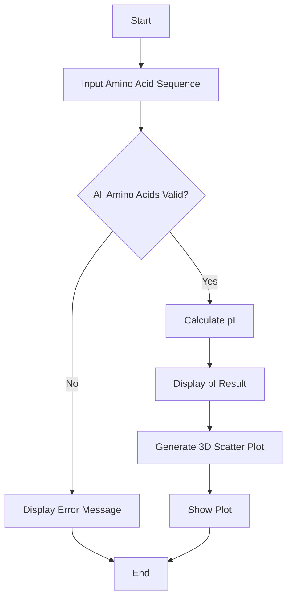
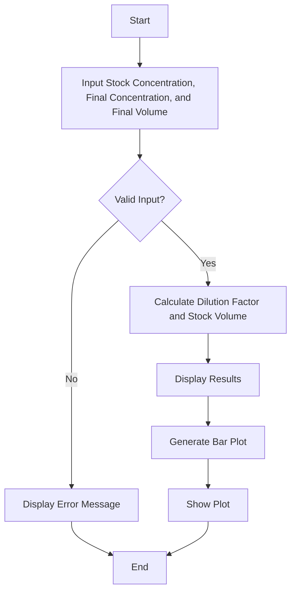
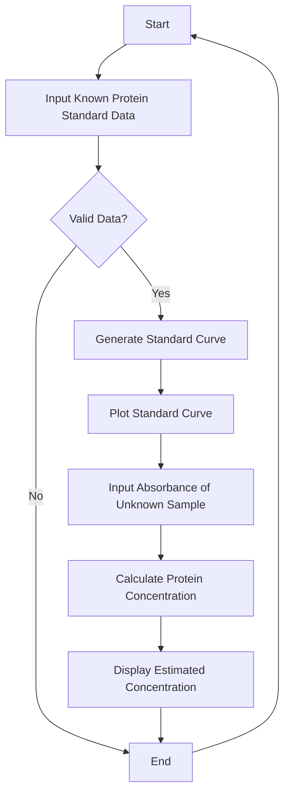
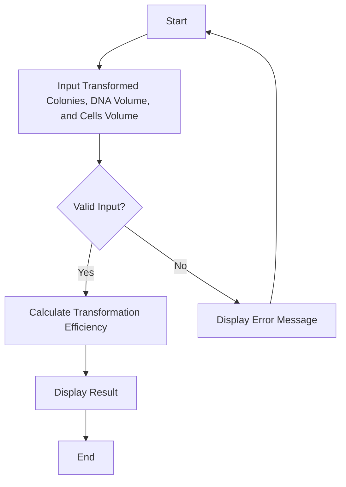
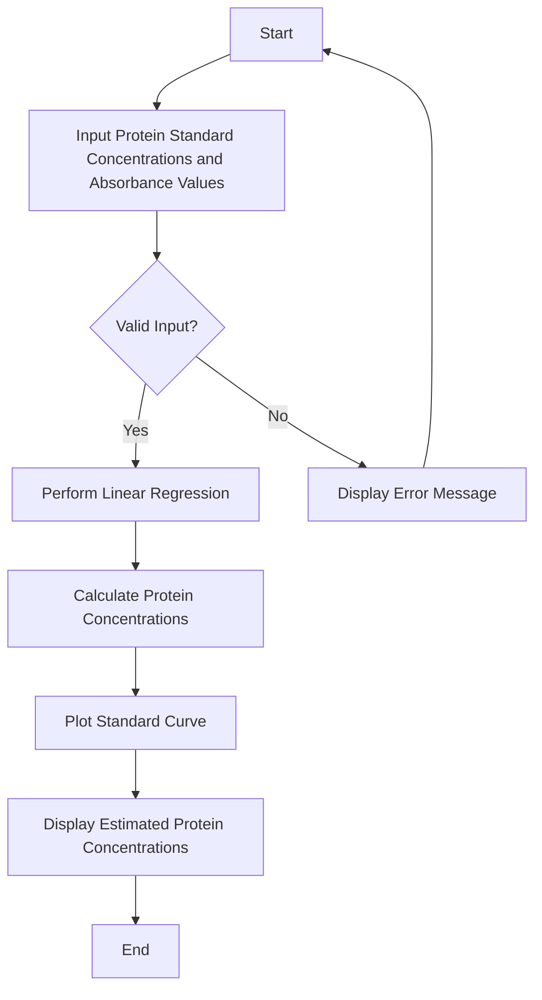
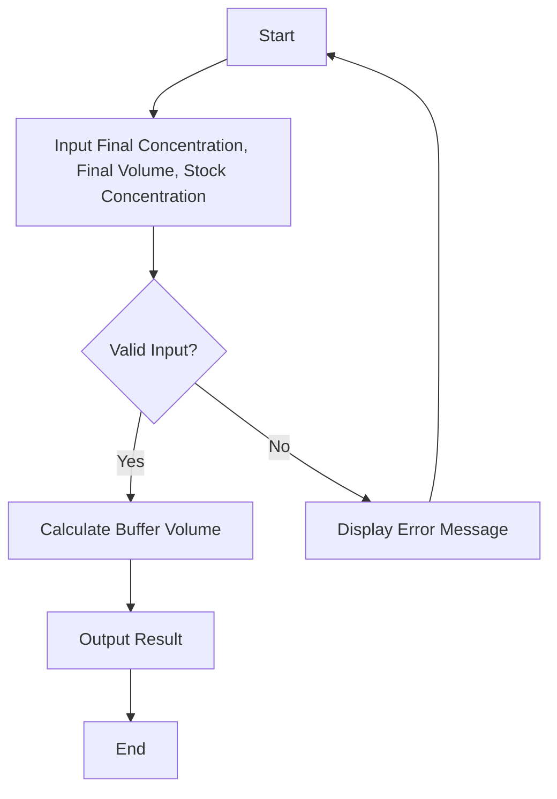

---

# Isoelectric Focusing Calculator

## Observation Summary
This project is a GUI application built using tkinter that calculates the theoretical isoelectric point (pI) of a given amino acid sequence. It also generates a 3D scatter plot displaying the pI values of standard amino acids using matplotlib.

## Dependencies
- 
- 
- 

## Installation
1. Clone the repository:
    ```bash
    git clone https://github.com/rubypoddar/python-projects.git
    cd python-projects
    ```

2. Install the required dependencies:
    ```bash
    pip install matplotlib
    ```

## Usage
1. Run the application:
    ```bash
    python "3d isoelectric focusing.py"
    ```

2. Enter an amino acid sequence in the input field and click "Calculate pI" to see the theoretical pI value.

3. A 3D scatter plot of amino acids and their pI values will be displayed.

## Project Overview
### calculate_pI
This function takes an amino acid sequence as input and calculates the theoretical pI value by averaging the pI values of the amino acids in the sequence.

### on_calculate
This function is triggered when the "Calculate pI" button is clicked. It validates the input sequence, calculates the pI, updates the result label, and generates a 3D scatter plot of amino acids and their pI values.

### tkinter GUI
A simple tkinter GUI is created with an entry field for the amino acid sequence, a button to calculate the pI, and a label to display the result.

## Flowchart


## Required


---

---

# Antibody Dilution Calculator

## Observation Summary
This project is a GUI application built using tkinter that calculates the required dilution factor and the volume of stock solution needed for an antibody dilution. It also generates a bar plot displaying the results using matplotlib.

## Dependencies
- 
- 
- 
- 

## Installation
1. Clone the repository:
    ```bash
    git clone https://github.com/rubypoddar/python-projects.git
    cd python-projects
    ```

2. Install the required dependencies:
    ```bash
    pip install matplotlib pandas
    ```

## Usage
1. Run the application:
    ```bash
    python "Antibody Dilution.py"
    ```

2. Enter the stock concentration, final concentration, and final volume in the input fields.

3. Click "Calculate Dilution" to see the dilution factor and the volume of stock solution needed.

4. A bar plot of the dilution results will be displayed.

## Project Overview
### calculate_antibody_dilution
This function takes input from the user for stock concentration, final concentration, and final volume, then calculates the required dilution factor and the volume of stock solution needed. It also generates a bar plot displaying these results using matplotlib.

### tkinter GUI
A simple tkinter GUI is created with entry fields for stock concentration, final concentration, and final volume, a button to calculate the dilution, and a label to display the result.

## Flowchart


## Required


---

# BCA Protein Assay Calculator

## Overview
This Python script calculates the concentration of a protein solution using the BCA (Bicinchoninic Acid) assay method. It generates a standard curve from known protein standard concentrations and their corresponding absorbance values, and then estimates the protein concentration of an unknown sample based on its absorbance.

## Features
- **Standard Curve Generation**: Calculates the slope and intercept of the standard curve using linear regression.
- **Protein Concentration Calculation**: Estimates the protein concentration of an unknown sample using the standard curve equation.
- **Plotting**: Generates a plot of the standard curve using matplotlib to visualize the relationship between protein concentrations and absorbance values.

## Dependencies
- Python 3.x
- numpy 1.21.0
- matplotlib 3.4.3

## Installation
1. Clone the repository:
    ```bash
    git clone https://github.com/rubypoddar/python-projects.git
    cd python-projects
    ```

2. Install dependencies:
    ```bash
    pip install numpy matplotlib
    ```

## Usage
1. Run the script:
    ```bash
    python BCA_protein_assay_calculator.py
    ```

2. Follow the prompts to enter the known protein standard concentrations and absorbance values.

3. The script will plot the standard curve and prompt you to enter the absorbance value of the unknown sample.

4. It will then calculate and display the estimated protein concentration of the unknown sample.

## Code Explanation
### `generate_standard_curve`
- Calculates the slope and intercept of the standard curve using numpy's `polyfit` function.

### `calculate_protein_concentration`
- Estimates the protein concentration of an unknown sample using the equation derived from the standard curve.

### `plot_standard_curve`
- Uses matplotlib to plot the standard curve based on provided data points.

### `main`
- Orchestrates the flow of the program, handling user input, data validation, function calls, and result display.

## Flowchart


## Required


---

# Bacterial Transformation Efficiency Calculator

## Overview
This Python GUI application calculates the transformation efficiency of bacterial cells based on transformed colonies, DNA volume, and competent cells volume. It provides the transformation efficiency in CFU/µg (Colony-Forming Units per microgram).

## Features
- **Input Fields**: Enter the number of transformed colonies, DNA volume, and competent cells volume.
- **Calculation**: Computes the transformation efficiency using the formula: `Transformation Efficiency = Transformed Colonies / (DNA Volume * Competent Cells Volume)`.
- **Output**: Displays the calculated transformation efficiency in CFU/µg.

## Dependencies
- Python 3.x
- tkinter (standard library)

## Installation
1. Clone the repository:
    ```bash
    git clone https://github.com/rubypoddar/python-projects.git
    cd python-projects
    ```

2. Ensure Python 3.x is installed on your system.

## Usage
1. Run the application:
    ```bash
    python Bacterial Transformation Efficiency.py
    ```

2. Enter the number of transformed colonies, DNA volume in µg, and competent cells volume in µL.
3. Click the "Calculate" button to compute the transformation efficiency.
4. The result will be displayed below the input fields.

## Code Explanation
### `calculate_transformation_efficiency`
- Retrieves input values for transformed colonies, DNA volume, and competent cells volume.
- Calculates the transformation efficiency using the provided formula.
- Updates the result label with the calculated efficiency.

### GUI Components
- **Labels and Entries**: Used to input data for transformed colonies, DNA volume, and cells volume.
- **Calculate Button**: Triggers the transformation efficiency calculation.
- **Result Label**: Displays the calculated transformation efficiency.

## Flowchart


## Required
- 
- 

---

# Bradford Protein Assay Calculator

## Overview
This Python script calculates the protein concentration using the Bradford assay based on protein standard concentrations and their corresponding absorbance values. It performs linear regression to generate a standard curve and uses it to estimate protein concentrations in mg/mL.

## Features
- **Input Fields**: Enter protein standard concentrations and absorbance values.
- **Calculation**: Performs linear regression to generate a standard curve and calculates protein concentrations.
- **Output**: Displays the standard curve plot and estimated protein concentrations.

## Dependencies
- Python 3.x
- numpy
- matplotlib

## Installation
1. Clone the repository:
    ```bash
    git clone https://github.com/rubypoddar/python-projects.git
    cd python-projects
    ```

2. Install dependencies:
    ```bash
    pip install numpy matplotlib
    ```

## Usage
1. Run the script:
    ```bash
    python Bradford_Protein_Assay_Calculator.py
    ```

2. Enter protein standard concentrations and absorbance values as prompted.
3. The script will plot the standard curve and display estimated protein concentrations.

## Code Explanation
### `linear_regression`
- Performs linear regression to calculate the slope and intercept of the standard curve.

### `bradford_assay`
- Calculates protein concentrations using the linear regression results from `linear_regression`.

### `plot_standard_curve`
- Plots the standard curve using matplotlib based on provided protein standard concentrations, absorbance values, and calculated protein concentrations.

### Flowchart


## Required
- 
- 
- 


---

# Buffer Volume Calculator

## Overview
This Python script calculates the volume of stock buffer solution required to achieve a desired final concentration and volume using the formula:
\[ \text{Buffer Volume} = \frac{\text{Final Concentration} \times \text{Final Volume}}{\text{Stock Concentration}} \]

## Features
- **Input**: Allows user input for final concentration, final volume, and stock concentration.
- **Calculation**: Computes the required volume of stock buffer solution.
- **Output**: Displays the calculated volume of stock buffer solution.

## Dependencies
- Python 3.x

## Installation
1. Clone the repository:
    ```bash
    git clone https://github.com/rubypoddar/python-projects.git
    cd python-projects
    ```

## Usage
1. Run the script:
    ```bash
    python buffer_volume_calculator.py
    ```
2. Enter the desired final concentration (in mM), final volume (in mL), and stock concentration (in mM) as prompted.
3. The script will calculate and output the volume of stock buffer solution needed.

## Code Explanation
### `calculate_buffer_volume`
- Function that computes the buffer volume required based on the provided final concentration, final volume, and stock concentration.

### Error Handling
- Handles `ValueError` for invalid input (non-numeric values).
- Handles `ZeroDivisionError` specifically for when the stock concentration is zero.
- Catches unexpected errors using a generic exception handler.

### Flowchart


## GitHub Badges
- 

---
