---

# Isoelectric Focusing Calculator

## Observation Summary
This project is a GUI application built using tkinter that calculates the theoretical isoelectric point (pI) of a given amino acid sequence. It also generates a 3D scatter plot displaying the pI values of standard amino acids using matplotlib.

## Dependencies
- 
- 
- 

## Installation
1. Clone the repository:
    ```bash
    git clone https://github.com/rubypoddar/python-projects.git
    cd python-projects
    ```

2. Install the required dependencies:
    ```bash
    pip install matplotlib
    ```

## Usage
1. Run the application:
    ```bash
    python "3d isoelectric focusing.py"
    ```

2. Enter an amino acid sequence in the input field and click "Calculate pI" to see the theoretical pI value.

3. A 3D scatter plot of amino acids and their pI values will be displayed.

## Project Overview
### calculate_pI
This function takes an amino acid sequence as input and calculates the theoretical pI value by averaging the pI values of the amino acids in the sequence.

### on_calculate
This function is triggered when the "Calculate pI" button is clicked. It validates the input sequence, calculates the pI, updates the result label, and generates a 3D scatter plot of amino acids and their pI values.

### tkinter GUI
A simple tkinter GUI is created with an entry field for the amino acid sequence, a button to calculate the pI, and a label to display the result.

## Flowchart
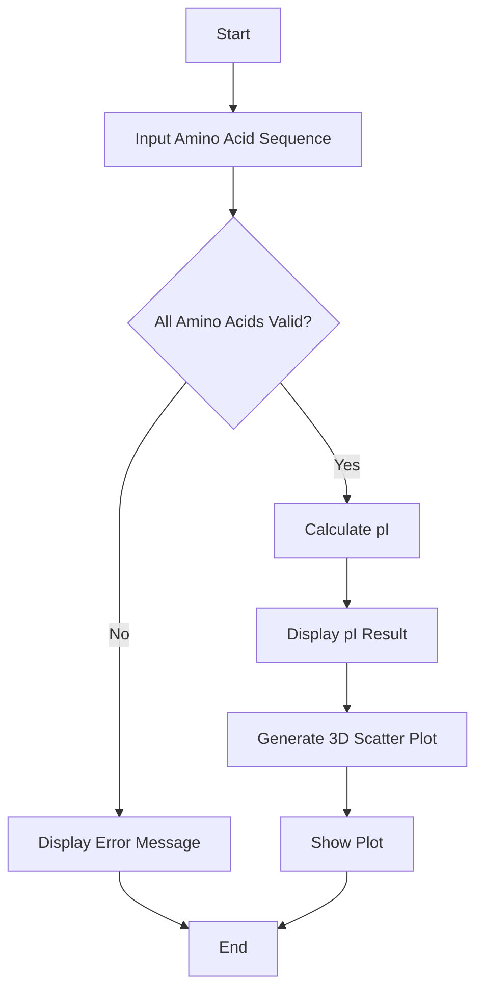

## Required


---

---

# Antibody Dilution Calculator

## Observation Summary
This project is a GUI application built using tkinter that calculates the required dilution factor and the volume of stock solution needed for an antibody dilution. It also generates a bar plot displaying the results using matplotlib.

## Dependencies
- 
- 
- 
- 

## Installation
1. Clone the repository:
    ```bash
    git clone https://github.com/rubypoddar/python-projects.git
    cd python-projects
    ```

2. Install the required dependencies:
    ```bash
    pip install matplotlib pandas
    ```

## Usage
1. Run the application:
    ```bash
    python "Antibody Dilution.py"
    ```

2. Enter the stock concentration, final concentration, and final volume in the input fields.

3. Click "Calculate Dilution" to see the dilution factor and the volume of stock solution needed.

4. A bar plot of the dilution results will be displayed.

## Project Overview
### calculate_antibody_dilution
This function takes input from the user for stock concentration, final concentration, and final volume, then calculates the required dilution factor and the volume of stock solution needed. It also generates a bar plot displaying these results using matplotlib.

### tkinter GUI
A simple tkinter GUI is created with entry fields for stock concentration, final concentration, and final volume, a button to calculate the dilution, and a label to display the result.

## Flowchart
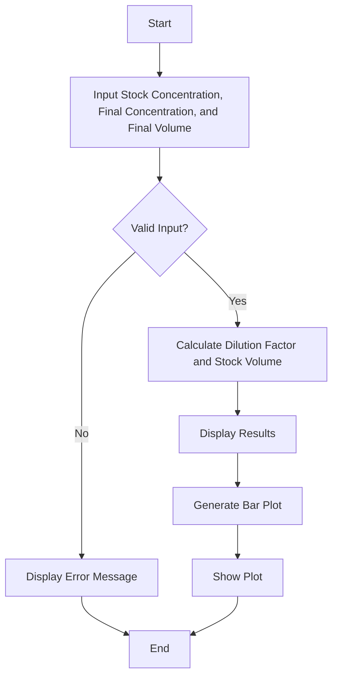

## Required


---

# BCA Protein Assay Calculator

## Overview
This Python script calculates the concentration of a protein solution using the BCA (Bicinchoninic Acid) assay method. It generates a standard curve from known protein standard concentrations and their corresponding absorbance values, and then estimates the protein concentration of an unknown sample based on its absorbance.

## Features
- **Standard Curve Generation**: Calculates the slope and intercept of the standard curve using linear regression.
- **Protein Concentration Calculation**: Estimates the protein concentration of an unknown sample using the standard curve equation.
- **Plotting**: Generates a plot of the standard curve using matplotlib to visualize the relationship between protein concentrations and absorbance values.

## Dependencies
- Python 3.x
- numpy 1.21.0
- matplotlib 3.4.3

## Installation
1. Clone the repository:
    ```bash
    git clone https://github.com/rubypoddar/python-projects.git
    cd python-projects
    ```

2. Install dependencies:
    ```bash
    pip install numpy matplotlib
    ```

## Usage
1. Run the script:
    ```bash
    python BCA_protein_assay_calculator.py
    ```

2. Follow the prompts to enter the known protein standard concentrations and absorbance values.

3. The script will plot the standard curve and prompt you to enter the absorbance value of the unknown sample.

4. It will then calculate and display the estimated protein concentration of the unknown sample.

## Code Explanation
### `generate_standard_curve`
- Calculates the slope and intercept of the standard curve using numpy's `polyfit` function.

### `calculate_protein_concentration`
- Estimates the protein concentration of an unknown sample using the equation derived from the standard curve.

### `plot_standard_curve`
- Uses matplotlib to plot the standard curve based on provided data points.

### `main`
- Orchestrates the flow of the program, handling user input, data validation, function calls, and result display.

## Flowchart
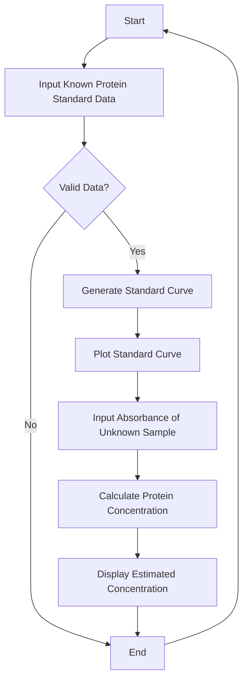

## Required


---

# Bacterial Transformation Efficiency Calculator

## Overview
This Python GUI application calculates the transformation efficiency of bacterial cells based on transformed colonies, DNA volume, and competent cells volume. It provides the transformation efficiency in CFU/µg (Colony-Forming Units per microgram).

## Features
- **Input Fields**: Enter the number of transformed colonies, DNA volume, and competent cells volume.
- **Calculation**: Computes the transformation efficiency using the formula: `Transformation Efficiency = Transformed Colonies / (DNA Volume * Competent Cells Volume)`.
- **Output**: Displays the calculated transformation efficiency in CFU/µg.

## Dependencies
- Python 3.x
- tkinter (standard library)

## Installation
1. Clone the repository:
    ```bash
    git clone https://github.com/rubypoddar/python-projects.git
    cd python-projects
    ```

2. Ensure Python 3.x is installed on your system.

## Usage
1. Run the application:
    ```bash
    python Bacterial Transformation Efficiency.py
    ```

2. Enter the number of transformed colonies, DNA volume in µg, and competent cells volume in µL.
3. Click the "Calculate" button to compute the transformation efficiency.
4. The result will be displayed below the input fields.

## Code Explanation
### `calculate_transformation_efficiency`
- Retrieves input values for transformed colonies, DNA volume, and competent cells volume.
- Calculates the transformation efficiency using the provided formula.
- Updates the result label with the calculated efficiency.

### GUI Components
- **Labels and Entries**: Used to input data for transformed colonies, DNA volume, and cells volume.
- **Calculate Button**: Triggers the transformation efficiency calculation.
- **Result Label**: Displays the calculated transformation efficiency.

## Flowchart
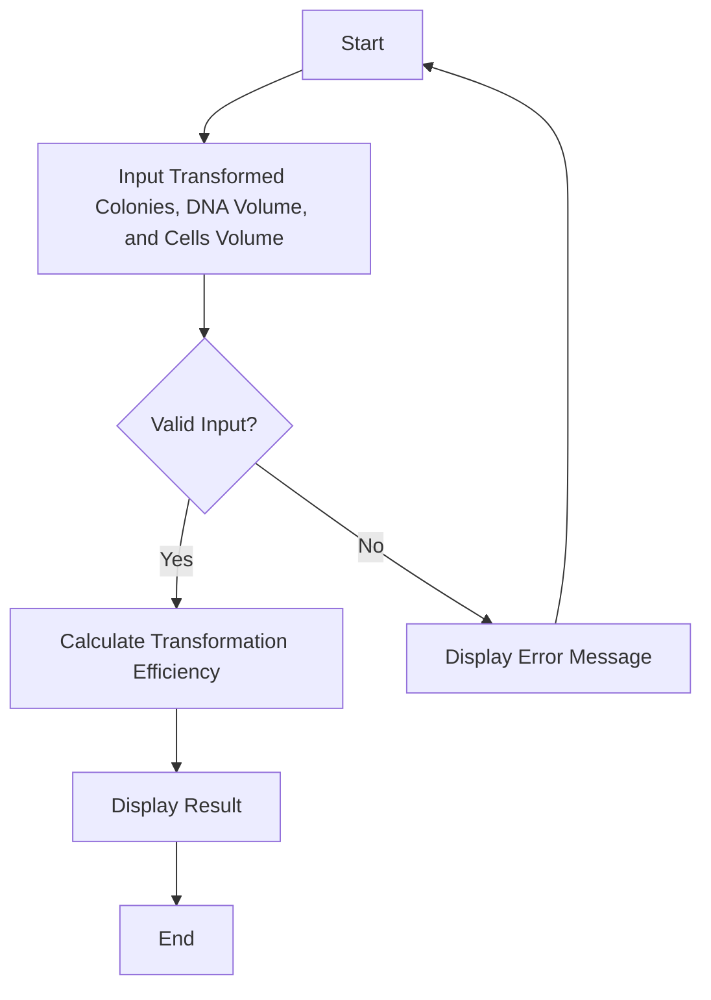

## Required
- 
- 

---

# Bradford Protein Assay Calculator

## Overview
This Python script calculates the protein concentration using the Bradford assay based on protein standard concentrations and their corresponding absorbance values. It performs linear regression to generate a standard curve and uses it to estimate protein concentrations in mg/mL.

## Features
- **Input Fields**: Enter protein standard concentrations and absorbance values.
- **Calculation**: Performs linear regression to generate a standard curve and calculates protein concentrations.
- **Output**: Displays the standard curve plot and estimated protein concentrations.

## Dependencies
- Python 3.x
- numpy
- matplotlib

## Installation
1. Clone the repository:
    ```bash
    git clone https://github.com/rubypoddar/python-projects.git
    cd python-projects
    ```

2. Install dependencies:
    ```bash
    pip install numpy matplotlib
    ```

## Usage
1. Run the script:
    ```bash
    python Bradford_Protein_Assay_Calculator.py
    ```

2. Enter protein standard concentrations and absorbance values as prompted.
3. The script will plot the standard curve and display estimated protein concentrations.

## Code Explanation
### `linear_regression`
- Performs linear regression to calculate the slope and intercept of the standard curve.

### `bradford_assay`
- Calculates protein concentrations using the linear regression results from `linear_regression`.

### `plot_standard_curve`
- Plots the standard curve using matplotlib based on provided protein standard concentrations, absorbance values, and calculated protein concentrations.

### Flowchart
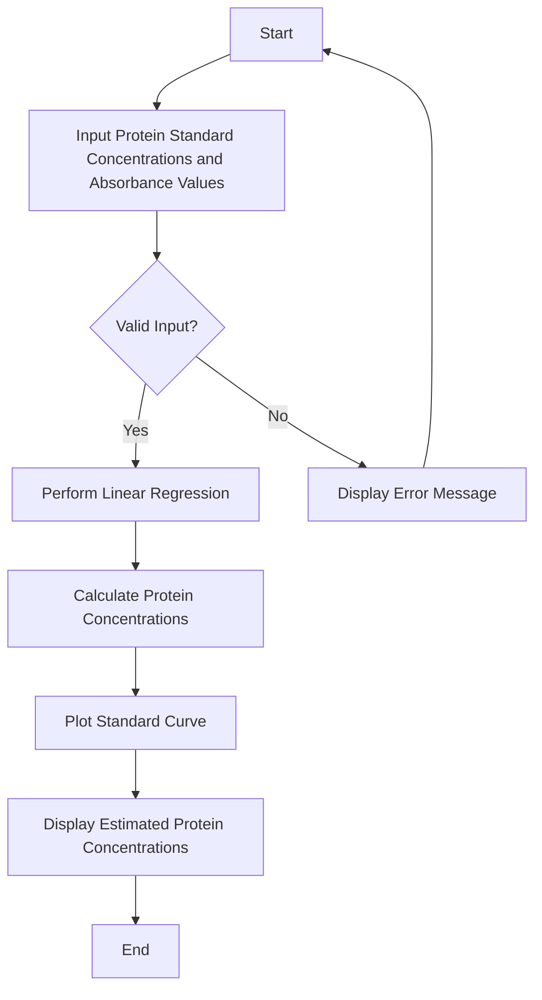

## Required
- 
- 
- 


---

# Buffer Volume Calculator

## Overview
This Python script calculates the volume of stock buffer solution required to achieve a desired final concentration and volume using the formula:
\[ \text{Buffer Volume} = \frac{\text{Final Concentration} \times \text{Final Volume}}{\text{Stock Concentration}} \]

## Features
- **Input**: Allows user input for final concentration, final volume, and stock concentration.
- **Calculation**: Computes the required volume of stock buffer solution.
- **Output**: Displays the calculated volume of stock buffer solution.

## Dependencies
- Python 3.x

## Installation
1. Clone the repository:
    ```bash
    git clone https://github.com/rubypoddar/python-projects.git
    cd python-projects
    ```

## Usage
1. Run the script:
    ```bash
    python buffer_volume_calculator.py
    ```
2. Enter the desired final concentration (in mM), final volume (in mL), and stock concentration (in mM) as prompted.
3. The script will calculate and output the volume of stock buffer solution needed.

## Code Explanation
### `calculate_buffer_volume`
- Function that computes the buffer volume required based on the provided final concentration, final volume, and stock concentration.

### Error Handling
- Handles `ValueError` for invalid input (non-numeric values).
- Handles `ZeroDivisionError` specifically for when the stock concentration is zero.
- Catches unexpected errors using a generic exception handler.

### Flowchart
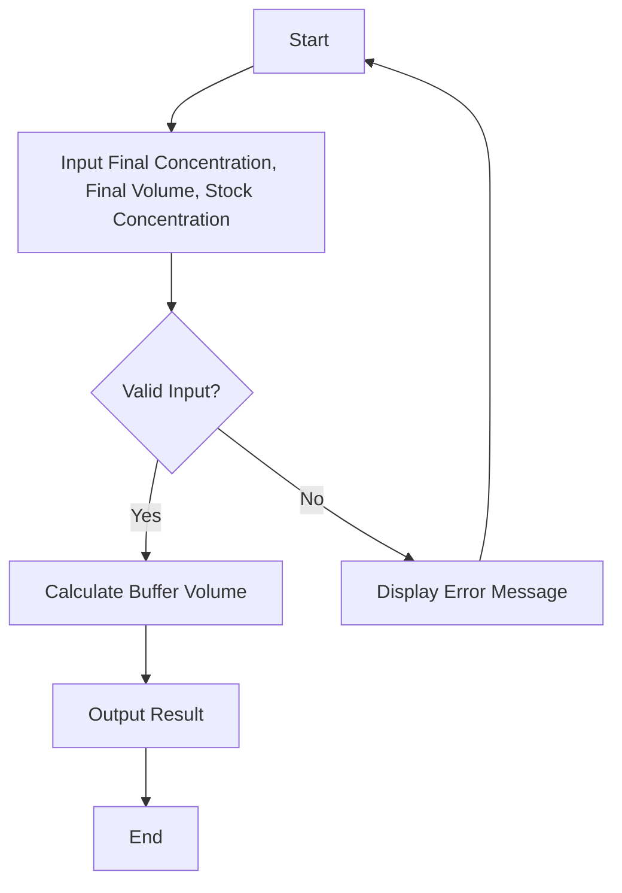

## GitHub Badges
- 


---

# Cell Passaging Calculator

## Overview
This Python script calculates the number of cells to seed and the volume of medium needed for passaging based on given parameters. It is useful for maintaining consistent cell densities in cell culture experiments.

## Dependencies
- 
- 

## Installation
1. Ensure Python 3.x is installed on your system.

## Usage
1. Clone the repository:
    ```bash
    git clone https://github.com/your-username/cell-passaging-calculator.git
    cd cell-passaging-calculator
    ```

2. Run the script:
    ```bash
    python passaging_calculator.py
    ```

3. Enter the current cell density, split ratio, and target cell density as prompted.

4. The script will calculate and display the number of cells to seed and the volume of medium needed for passaging.

## Function Explanation
### `calculate_passaging`
- Calculates the number of cells to seed and the volume of medium needed based on the current cell density, split ratio, and target cell density.

### `main`
- Orchestrates the flow of the program, handling user input, function calls, and result display.

## Flowchart
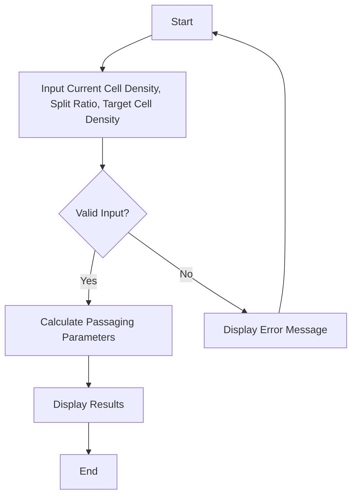

## Example
```bash
Enter the current cell density (cells/cm^2): 1000
Enter the split ratio (e.g., 1:2 for 1 part of cells to 2 parts of fresh medium): 1.5
Enter the target cell density after passaging (cells/cm^2): 2000
Number of cells to seed: 1500.00 cells
Volume of medium needed: 1.50 mL
```

---

# Cell Doubling Time Calculator

## Overview
This Python script calculates the doubling time of cells during a growth period based on initial and final cell counts and the duration of the growth period.

## Dependencies
- 
- 
- 
- 

## Installation
1. Ensure Python 3.x is installed on your system.
2. Install the required dependencies:
    ```bash
    pip install numpy pandas matplotlib
    ```

## Usage
1. Clone the repository:
    ```bash
    git clone https://github.com/your-username/cell-doubling-time-calculator.git
    cd cell-doubling-time-calculator
    ```

2. Run the script:
    ```bash
    python cell_doubling_time_calculator.py
    ```

3. Follow the prompts to enter the initial number of cells, final number of cells, and duration of the growth period.

4. The script will calculate and display the estimated doubling time of the cell population in hours and visualize the initial and final cell counts using a bar plot.

## Function Explanation
### `calculate_doubling_time`
- Calculates the doubling time of cells based on the initial and final cell counts and the duration of the growth period.

### `main`
- Handles user input, calls the `calculate_doubling_time` function, and displays the results.

## Flowchart
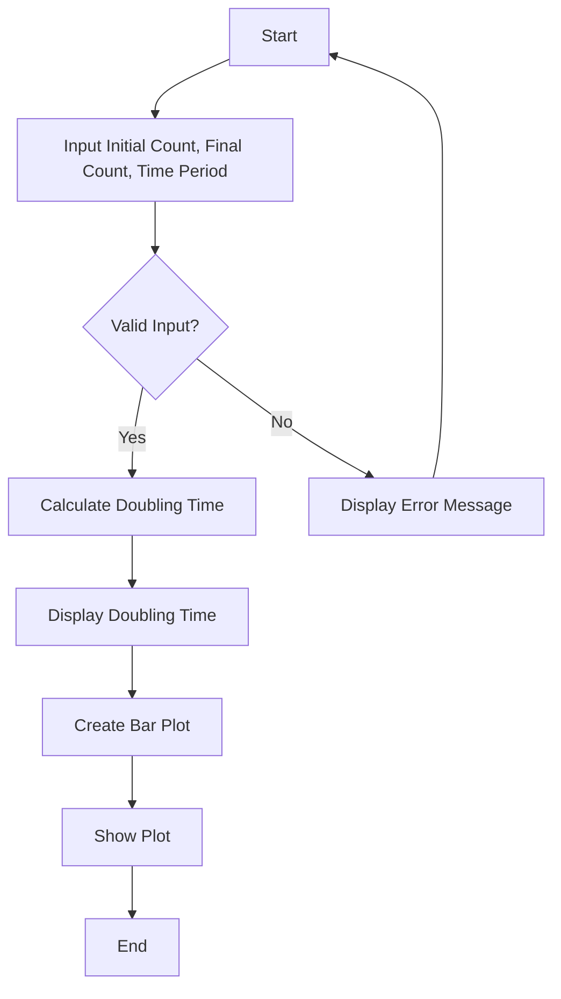

## Example
```bash
Welcome to the Cell Doubling Time Calculator!
This calculator estimates the time taken for a population of cells to double.

Enter the initial number of cells: 100
Enter the final number of cells: 1000
Enter the duration of the growth period (in hours): 24

Estimated Doubling Time: 7.38 hours
```

---

# Colony Forming Unit (CFU) Calculator

## Overview
This Python tkinter application calculates the Colony Forming Units per milliliter (CFU/mL) based on user inputs for dilution factor, volume plated, and colonies counted. It provides a quick estimate of the concentration of viable cells in a sample.

## Dependencies
- 
- 

## Installation
1. Ensure Python 3.x is installed on your system.

## Usage
1. Run the application:
    ```bash
    python cfu_calculator.py
    ```

2. Enter the dilution factor, volume plated (in mL), and number of colonies counted.
3. Click the "Calculate CFU/mL" button to see the calculated CFU/mL.

## Code Explanation
### `calculate_cfu`
- Retrieves input values for dilution factor, volume plated, and colonies counted.
- Calculates CFU/mL using the formula: `CFU/mL = Colonies Counted / (Dilution Factor * Volume Plated)`.
- Updates the result label with the calculated CFU/mL or displays an error message for invalid inputs.

### GUI Components
- **Entries**: Input fields for dilution factor, volume plated, and colonies counted.
- **Calculate Button**: Triggers the CFU calculation.
- **Result Label**: Displays the calculated CFU/mL or error message.

## Flowchart
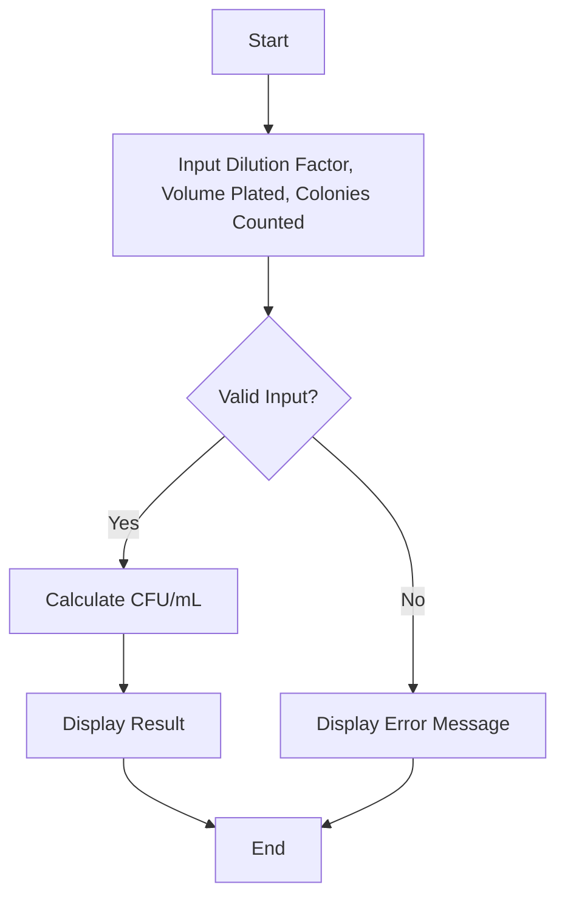

## Required
- 
- 


---

# Dynamic Light Scattering (DLS) Particle Size Calculator

## Overview
This Python tkinter application estimates the particle size using Dynamic Light Scattering (DLS) based on user inputs for temperature, viscosity, scattering angle, laser wavelength, and autocorrelation time. It provides an estimation of the particle size in nanometers (nm) using the given parameters.

## Dependencies
- 
- 
- 

## Installation
1. Ensure Python 3.x is installed on your system.
2. Install required libraries:
    ```bash
    pip install numpy
    ```

## Usage
1. Run the application:
    ```bash
    python dls_particle_size_calculator.py
    ```

2. Enter the temperature (in °C), viscosity (in cP), scattering angle (in degrees), laser wavelength (in nm), and autocorrelation time (in s).
3. Click the "Calculate" button to see the estimated particle size in nanometers.

## Code Explanation
### `dls_particle_size`
- Retrieves input values for temperature, viscosity, scattering angle, laser wavelength, and autocorrelation time.
- Calculates the particle size using the DLS formula.
- Updates the result label with the estimated particle size or displays an error message for invalid inputs.

### GUI Components
- **Entries**: Input fields for temperature, viscosity, scattering angle, laser wavelength, and autocorrelation time.
- **Calculate Button**: Triggers the particle size calculation.
- **Result Label**: Displays the estimated particle size or error message.

## Flowchart
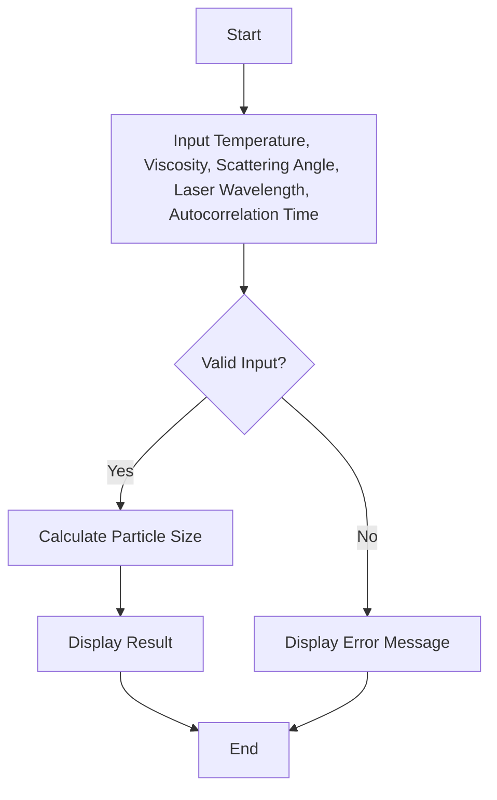

## Required
- 
- 
- 

---

# DNA/RNA Sequence Molecular Weight Calculator

## Overview
This Python script calculates the molecular weight of a DNA or RNA sequence based on its nucleotide composition. It considers the atomic weights of carbon (C), hydrogen (H), nitrogen (N), and oxygen (O) to compute the total molecular weight in grams per mole (g/mol).

## Dependencies
- 
- 
- 

## Installation
1. Ensure Python 3.x is installed on your system.
2. Install required libraries:
    ```bash
    pip install pandas numpy
    ```

## Usage
1. Run the script:
    ```bash
    python calculate_molecular_weight.py
    ```

2. Enter the DNA/RNA sequence when prompted.
3. Specify whether the sequence is RNA by entering 'y' or 'n' when prompted.
4. The script will calculate and display the molecular weight of the sequence in g/mol.

## Code Explanation
### `calculate_molecular_weight`
- Computes the molecular weight based on the nucleotide composition of the input sequence.
- Adjusts for RNA sequences by subtracting one oxygen atom due to uracil replacing thymine.
- Uses atomic weights of C (12.01), H (1.01), N (14.01), and O (16.00) to calculate molecular weight.

### Input Handling
- Prompts the user to input the DNA/RNA sequence and specify if it's RNA.
- Handles user input validation to ensure correct sequence type identification.

## Flowchart
```mermaid
flowchart TD
    A[Start] --> B[Input DNA/RNA Sequence]
    B --> C{Is it RNA?}
    C -->|Yes| D[Calculate Molecular Weight (RNA)]
    D --> E[Display Molecular Weight]
    C -->|No| F[Calculate Molecular Weight (DNA)]
    F --> E
    E --> G[End]
```

## Required
- 
- 
- 

---

# Protein-DNA Binding Affinity Calculator

## Overview
This Python script calculates the binding affinity between a protein and DNA sequence based on the dissociation constant (Kd) and DNA concentration using a logistic function. It visualizes the calculated binding affinities using a line plot.

## Dependencies
- 
- 
- 
- 

## Installation
1. Ensure Python 3.x is installed on your system.
2. Install required libraries:
    ```bash
    pip install numpy matplotlib seaborn
    ```

## Usage
1. Run the script:
    ```bash
    python binding_affinity_calculator.py
    ```

2. Enter DNA concentrations separated by commas when prompted.
3. Enter the dissociation constant (Kd) and the cooperativity factor (optional).
4. The script will calculate and display the binding affinities and visualize them in a line plot using Seaborn.

## Code Explanation
### `binding_affinity_model`
- Calculates the binding affinity using a logistic function based on DNA concentrations, Kd, and cooperativity (optional).
- Returns an array of calculated binding affinities.

### Input Handling
- Prompts the user to input DNA concentrations and parameters (Kd, cooperativity).
- Converts user input into appropriate data types and handles input validation.

## Flowchart
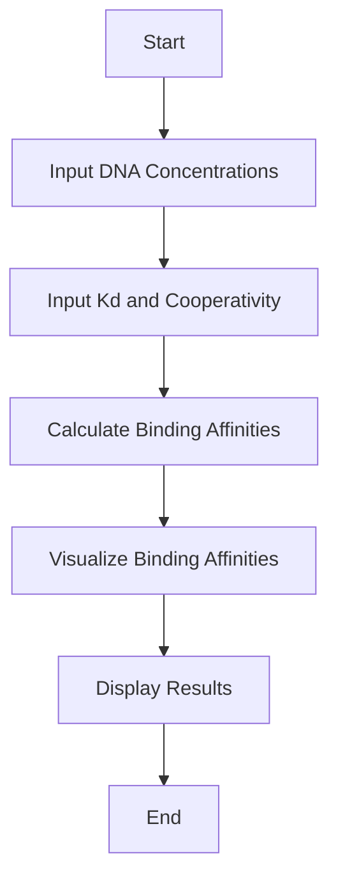

## Required
- 
- 
- 
- 

---

# Melting Temperature (Tm) Calculator

## Overview
This Python script calculates the melting temperature (Tm) of a DNA sequence using the nearest-neighbor method based on the thermodynamic parameters of adjacent nucleotide pairs. It provides an estimation of the temperature at which half of the DNA strands are in the double-helix state and half are in the single-strand state.

## Dependencies
- 
  
## Installation
1. Ensure Python 3.x is installed on your system.

## Usage
1. Run the script:
    ```bash
    python tm_calculator.py
    ```

2. Enter a DNA sequence when prompted.
3. The script will calculate and display the melting temperature (Tm) of the sequence.

## Code Explanation
### `calculate_tm`
- Calculates Tm using the nearest-neighbor method, which sums the enthalpy and entropy contributions of adjacent nucleotide pairs.
- Estimates Tm based on the formula derived from these contributions and the concentration of DNA.

### Input Handling
- Prompts the user to input a DNA sequence.
- Validates input and calculates Tm based on the provided sequence.

## Flowchart
```mermaid
flowchart TD
    A[Start] --> B[Input DNA Sequence]
    B --> C[Calculate Melting Temperature (Tm)]
    C --> D[Display Tm]
    D --> E[End]
```

## Required
- 

---

# Dilution Calculator

## Overview
This Python script calculates the final concentration of a solution after dilution based on the initial concentration, initial volume, and final volume of the solution. It's useful for laboratory settings where precise dilutions are required.

## Dependencies
- 

## Installation
1. Ensure Python 3.x is installed on your system.

## Usage
1. Run the script:
    ```bash
    python dilution_calculator.py
    ```

2. Enter the initial concentration, initial volume, and final volume of the solution when prompted.
3. The script will calculate and display the final concentration of the solution after dilution.

## Code Explanation
### `calculate_final_concentration`
- Calculates the final concentration of a solution after dilution using the formula:
  \[
  \text{Final Concentration} = \frac{\text{Initial Concentration} \times \text{Initial Volume}}{\text{Final Volume}}
  \]
- Returns the final concentration in units of mol/L or M (molarity).

### Input Handling
- Prompts the user to input the initial concentration, initial volume, and final volume.
- Validates input and computes the final concentration based on the provided values.

## Flowchart
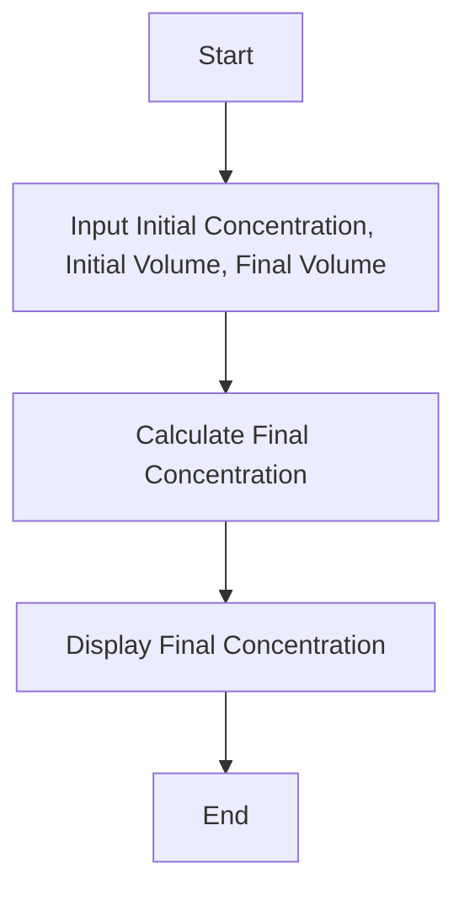

## Example
Suppose we have an initial concentration of 0.1 M, initial volume of 2 L, and final volume of 10 L:
- Input:
  - Initial concentration: 0.1
  - Initial volume: 2
  - Final volume: 10
- Output:
  - Final Concentration of the Solution: 0.02 mol/L

## Required
- 

---


# Advanced Dilution Calculator

## Overview
This Python script computes the final concentration of a solution after dilution, supporting multiple concentration units (M, mM, μM). It also visualizes the dilution process using matplotlib.

## Dependencies
- 
- 
- 
- 

## Installation
1. Ensure Python 3.x is installed on your system.
2. Install required libraries:
   ```bash
   pip install numpy pandas matplotlib
   ```

## Usage
1. Run the script:
    ```bash
    python dilution_calculator.py
    ```

2. Enter the initial concentration (in mol/L), initial volume (in liters), final volume (in liters), and unit of concentration (M, mM, or μM) when prompted.
3. The script will calculate and display the final concentration of the solution after dilution.
4. A plot illustrating the dilution process will be displayed using matplotlib.

## Code Explanation
### `calculate_final_concentration`
- Calculates the final concentration of a solution after dilution based on the provided initial concentration, initial volume, final volume, and concentration unit (M, mM, μM).
- Handles different concentration units to ensure accurate calculation and output.

### Input Handling
- Prompts the user to input the initial concentration, initial volume, final volume, and concentration unit.
- Validates input to ensure non-negative values for concentration and volumes.

### Visualization
- Uses matplotlib to visualize the dilution process with a plot showing how concentration changes with volume during dilution.

## Flowchart
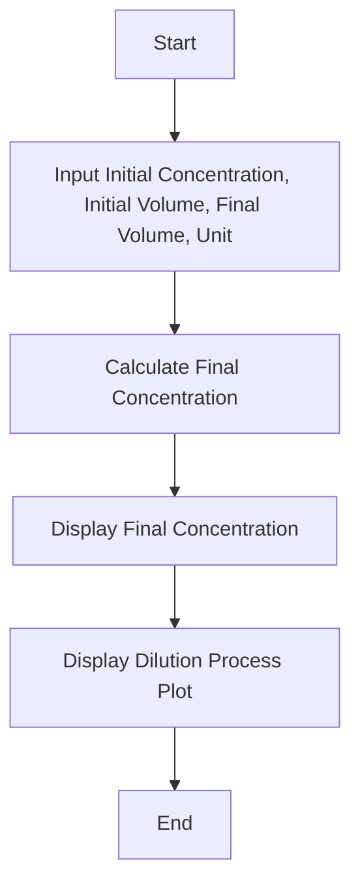

## Example
Suppose we have an initial concentration of 0.1 M, initial volume of 2 L, final volume of 10 L, and unit 'M':
- Input:
  - Initial concentration: 0.1
  - Initial volume: 2
  - Final volume: 10
  - Unit: M
- Output:
  - Final Concentration of the Solution: 0.0200 M

## Required
- 
- 
- 
- 

---
# Drug Dose Calculator (for in vitro experiments)

## Overview
This tkinter-based application calculates the volume of stock solution needed based on the stock concentration, final concentration, and final volume for drug dosing in in vitro experiments.

## Dependencies
- 
- 

## Installation
1. Ensure Python 3.x is installed on your system.
2. No additional libraries are required as tkinter is included in Python's standard library.

## Usage
1. Run the script:
    ```bash
    python drug_dose_calculator.py
    ```
2. Enter the stock concentration (in mg/mL), final concentration (in mg/mL), and final volume (in mL) when prompted.
3. Click the "Calculate Drug Dose" button to compute the required volume of stock solution.
4. The application will display the volume of stock solution needed in mL.

## Code Explanation
### `calculate_drug_dose`
- Retrieves input values for stock concentration, final concentration, and final volume from tkinter Entry widgets.
- Calculates the required volume of stock solution using the formula: \( \text{Stock Volume} = \frac{\text{Final Concentration} \times \text{Final Volume}}{\text{Stock Concentration}} \).
- Handles exceptions for invalid input values.

### GUI Components
- **Labels and Entries:** tkinter widgets for inputting stock concentration, final concentration, and final volume.
- **Calculate Button:** Executes the `calculate_drug_dose` function when clicked.
- **Result Label:** Displays the calculated volume of stock solution needed.

### Flowchart
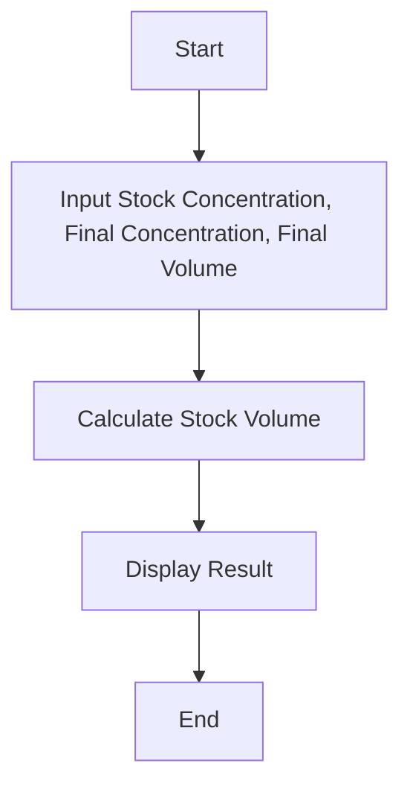

## Example
Suppose we have:
- Stock concentration: 10 mg/mL
- Final concentration: 2 mg/mL
- Final volume: 50 mL
- Output:
  - Required Volume of Stock Solution: 10 mL

## Required
- 
- 

---
